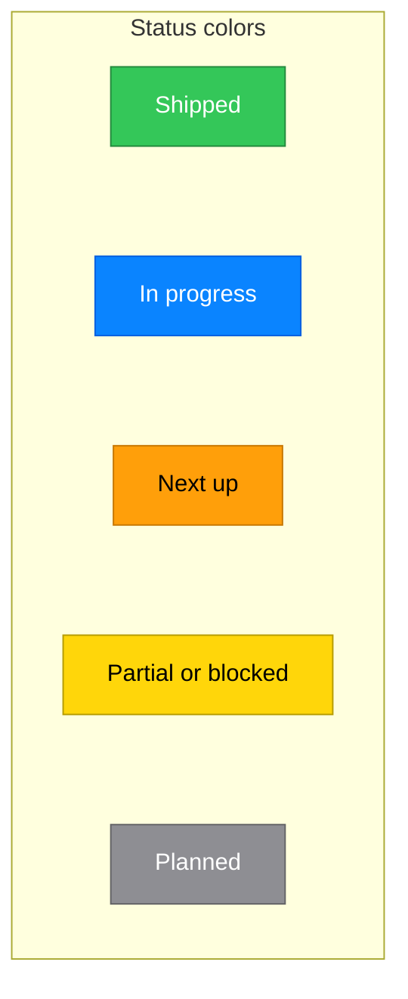
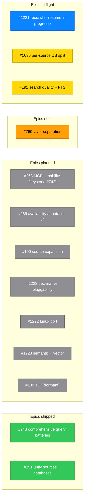

# 🍎📚 Cupertino

**Apple documentation CLI for humans and MCP server for AI agents.**

Cupertino is a CLI for human developers and an MCP server for AI agents. Both surfaces use the same local index of Apple documentation, Swift packages, sample code, Human Interface Guidelines, Swift Evolution proposals, and Swift.org pages.

[](https://swift.org)
[](https://www.apple.com/macos)
[](LICENSE)
[](https://www.pulsemcp.com/servers/mihaelamj-cupertino)
[](https://lobehub.com/mcp/mihaelamj-cupertino)
[](https://x.com/cupertinomcp)


> **Latest: v1.3.0** (2026-05-31): per-source database bundle, read-only databases. The shipped bundle carries **351,505 documents / 240,543 symbols across 420+ frameworks**. [Release notes](https://github.com/mihaelamj/cupertino/releases/tag/v1.3.0) · [CHANGELOG](CHANGELOG.md) · [Roadmap](#roadmap) · live dashboard at <https://cupertino.aleahim.com/>. Follow updates on X: [@cupertinomcp](https://x.com/cupertinomcp).

## What is Cupertino?

Cupertino is a local, structured documentation system for Apple platforms. It:

- **Crawls** Apple Developer documentation, Swift.org, Swift Evolution proposals, Human Interface Guidelines, Apple Archive legacy guides, and Swift package metadata
- **Indexes** everything into a fast, searchable SQLite FTS5 database with field-weighted BM25 (BM25F) ranking and AST-extracted symbol columns
- **Runs** as a terminal CLI for developers who want fast local `search`, `read`, `doctor`, and `setup` commands
- **Serves** the same corpus to AI agents like Claude, ChatGPT, Codex, Cursor, and Copilot via the Model Context Protocol
- **Provides** offline access to 351,505 documentation pages / 240,543 symbols across 420+ frameworks (v1.3.0 bundle)

Why build this:

- **No more hallucinations**: AI agents get accurate, up-to-date Apple API documentation
- **Offline development**: work with full documentation without internet access
- **Deterministic search**: the same query always returns the same results
- **Local control**: own your documentation, inspect the database, script workflows
- **Dual-consumer design**: use it directly at the terminal or wire it into an MCP-capable AI client

## Installation

Requires **macOS 15+ (Sequoia)** and ~4.2 GB free disk for the full v1.3.0 bundle (compressed download ~742 MB). Building from source additionally needs Swift 6.3+ and Xcode 26+ (use `xcrun swift build`, not bare `swift`).

**One-command install (recommended)**: downloads a signed, notarized universal binary to `/usr/local/bin` and fetches the databases:

```bash
bash <(curl -sSL https://raw.githubusercontent.com/mihaelamj/cupertino/main/install.sh)
```

**Homebrew:**

```bash
brew tap mihaelamj/tap
brew install cupertino
cupertino setup            # download the pre-built databases
```

**Build from source:**

```bash
git clone https://github.com/mihaelamj/cupertino.git
cd cupertino
make build                 # release binary (or: cd Packages && swift build -c release)
sudo make install          # install to /usr/local/bin
cupertino setup            # download the pre-built databases
```

> The Homebrew path on Apple Silicon installs to `/opt/homebrew/bin/cupertino`; Intel and manual installs use `/usr/local/bin/cupertino`. Run `which cupertino` to confirm your path. See [docs/DEPLOYMENT.md](docs/DEPLOYMENT.md) for distribution and CI/CD notes.

## Quick start

```bash
cupertino setup                                  # download pre-built databases (~30s)
cupertino search "NavigationStack" --limit 5     # search from the terminal
cupertino read "apple-docs://swiftui/documentation_swiftui_navigationstack" --source apple-docs
cupertino doctor                                 # check local database health
cupertino serve                                  # start the MCP server (also the default command)
```

Prefer to build the index yourself instead of downloading it? `cupertino save --remote` streams the corpus from GitHub and rebuilds locally, and `cupertino fetch --source <name>` crawls a single source from the original site. See [docs/commands/](docs/commands/) for every command, flag, and the slower self-hosted paths.

### Two surfaces, one index

A terminal search prints a human-friendly result with scores and follow-up commands:

```text
$ cupertino search "NavigationStack" --format text --limit 2
Question: NavigationStack
Searched: apple-docs, samples, swift-evolution, swift-org, swift-book, packages

======================================================================
[1] NavigationStack  •  source: apple-docs  •  score: 0.0324
    apple-docs://swiftui/documentation_swiftui_navigationstack
----------------------------------------------------------------------
A view that displays a root view and enables navigation to additional views.

▶ Read full: cupertino read "apple-docs://swiftui/documentation_swiftui_navigationstack" --source apple-docs

💡 Narrow with --source <name>: apple-docs, samples, hig, apple-archive, swift-evolution, swift-org, swift-book, packages
💡 Filter by platform: --platform iOS --min-version 16.0  (or macOS / tvOS / watchOS / visionOS)
```

The same query over MCP returns a structured tool result an AI client can read, cite, and follow with `read_document`:

```json
{
  "name": "search",
  "arguments": { "query": "NavigationStack", "source": "apple-docs", "limit": 2 }
}
```

**Demo:** [Watch on YouTube](https://youtu.be/B-mRdainTMA).

### Use with AI agents

[Claude Code](https://code.claude.com/docs/en/overview) registers Cupertino globally with one command:

```bash
claude mcp add cupertino --scope user -- $(which cupertino)
```

Claude Desktop, OpenAI Codex, Cursor, VS Code (Copilot), GitHub Copilot for Xcode, Zed, Windsurf, and opencode are all covered with copy-paste config in **[docs/mcp-clients.md](docs/mcp-clients.md)**. Cupertino can also run as a stateless CLI **Agent Skill** with no server: see **[docs/agent-skill.md](docs/agent-skill.md)**.

### What you get

| Framework | Documents |
|-----------|----------:|
| Kernel | 39,396 |
| Matter | 24,320 |
| Swift | 17,466 |
| AppKit | 12,443 |
| Foundation | 12,423 |
| UIKit | 11,158 |
| Accelerate | 9,114 |
| SwiftUI | 7,062 |
| ... | ... |
| **420+ frameworks** | **351,505** |

## Core features

### Multi-source documentation

- **Apple Developer Documentation** (~351,505 indexed pages): JavaScript-aware rendering via WKWebView, HTML-to-Markdown conversion, smart change detection
- **Swift Evolution** (~429 proposals) and **Swift.org** (~501 pages): GitHub- and site-based fetching in Markdown
- **Swift package metadata**: `packages.db` ships 185 packages with full source, stars, licenses, deployment-target platforms, and authored `swift-tools-version`
- **Apple Sample Code** (619 projects, 18,000+ indexed Swift files): fetched from Apple's CDN or the GitHub mirror, full-text searchable
- **Apple Archive legacy guides** (~75 pages): pre-2016 conceptual docs (Core Animation, Quartz 2D, Core Text); excluded from search by default (`--include-archive`)
- **Human Interface Guidelines**: Apple's design guidelines across iOS, macOS, watchOS, visionOS, and tvOS

### Full-text search engine

- **BM25F ranking**: SQLite FTS5 with field-weighted BM25 (Robertson/Zaragoza/Taylor 2004) over a 9-column index (`uri`, `source`, `framework`, `language`, `title`, `content`, `summary`, `symbols`, `symbol_components`). Title 10×, AST-extracted symbols 5×, summary 3×, framework 2×, CamelCase-split components 1.5×.
- **AST-aware**: a Swift extractor pulls identifiers from every embedded code block and the page declaration into a `symbols` column, so a query like `Task` ranks the Swift `Task` struct above prose mentions of "task".
- **smart-query**: `cupertino search` (and the `Search.SmartQuery` API) fans the question across every source in parallel and fuses per-source rankings via reciprocal rank fusion (RRF, k=60, Cormack/Clarke/Büttcher 2009); one dead source never takes the whole query down.
- Porter stemming, framework + platform-availability filtering, snippet generation, sub-100 ms queries.
- Databases must live on a local filesystem (SQLite is unreliable on NFS/SMB).

### Model Context Protocol server

- **Resources**: direct page access via `apple-docs://{framework}/{page}`, `swift-evolution://{proposal-id}`, `hig://{category}/{page}`
- **`search`**: unified full-text search across every indexed source. Parameters: `query` (required), `source`, `framework`, `language`, `include_archive`, `limit`, and the `min_ios`/`min_macos`/`min_tvos`/`min_watchos`/`min_visionos`/`min_swift` platform filters (AND-combined; malformed values are rejected at the boundary with a clear error frame). Replaces the pre-[#239](https://github.com/mihaelamj/cupertino/issues/239) per-source tools.
- **`list_frameworks`**, **`read_document`** (`format`: `json` for agents, `markdown` for humans)
- **Sample-code tools**: `list_samples`, `read_sample`, `read_sample_file`
- **AST-powered symbol tools** ([#81](https://github.com/mihaelamj/cupertino/issues/81)): `search_symbols`, `search_property_wrappers`, `search_concurrency`, `search_conformances`, `search_generics`, `get_inheritance`

See **[docs/tools/](docs/tools/)** for per-tool documentation.

### Intelligent crawling

Resumable from saved state, change-detection to skip unchanged pages, a respectful 0.05 s default delay (configurable), automatic URL-queue deduplication, and priority queues so important content is fetched first.

## How it works

Cupertino uses an **[ExtremePackaging](https://aleahim.com/blog/extreme-packaging/)** architecture: 49 strict-producer SPM targets across 63 source packages. See [`docs/ARCHITECTURE.md`](docs/ARCHITECTURE.md) for the full breakdown and [`docs/package-import-contract.md`](docs/package-import-contract.md) for the strict per-target import rules.

```
Foundation tier:   SharedConstants, LoggingModels, MCPCore, MCPSharedTools, Resources
Infrastructure:    ASTIndexer, Diagnostics, Logging (concrete, composition-root only)
Producers:         Crawler, Core, Search, SampleIndex, Services,
                   AppleConstraintsKit, Availability, Cleanup, and more
Operation packs:   Distribution (setup), Diagnostics (doctor),
                   Indexer (save), Ingest (fetch)
MCP layer:         MCPSupport, MCPClient, SearchToolProvider
Front doors:       CLI (cupertino), TUI (cupertino-tui)
```

Data flows through three distinct phases:

```
1. Fetch   cupertino fetch --source apple-docs
           WKWebView → Apple JSON API → JSON files on disk (~/.cupertino/docs/)
2. Save    cupertino save --all
           JSON → parse + AST extract → per-source SQLite FTS5 indexes
           (~/.cupertino/apple-documentation.db, hig.db, …)
3. Serve   cupertino serve
           MCP server (stdio) ← JSON-RPC ← AI client
           DocsResourceProvider + CupertinoSearchToolProvider
```

Key design principles: Swift 6.3 with 100% strict concurrency checking, value semantics and `Sendable` by default, actor isolation (`@MainActor` for WKWebView), explicit dependency injection with no singletons, and a hard separation of Crawling → Indexing → Serving.

### Published packages

Cupertino factors three reusable, independently-versioned Swift packages out of the monorepo. Each is its own public repository, depended on by tag (`from: "0.1.0"`), Foundation-only, and built so an external consumer can adopt it without pulling in cupertino's engine:

| Package | Repo | What it is |
|---|---|---|
| **SwiftMCPCore** | [mihaelamj/SwiftMCPCore](https://github.com/mihaelamj/SwiftMCPCore) | Neutral MCP wire types (the JSON-RPC + protocol value types). Not cupertino-specific; a general MCP building block. |
| **SwiftMCPClient** | [mihaelamj/SwiftMCPClient](https://github.com/mihaelamj/SwiftMCPClient) | Neutral, transport-injectable MCP client (`Client.MCP` seam, `MCPClient` actor, subprocess transport). Depends on SwiftMCPCore. |
| **CupertinoDataKit** | [mihaelamj/CupertinoDataKit](https://github.com/mihaelamj/CupertinoDataKit) | Cupertino's public **read contract**: the documentation + sample-code read protocols (`Search.DocumentReading`, `Search.SymbolReading`, `Search.Database`, `Sample.Index.Reader`) plus every value type they return. Protocols + value types only, zero implementation; cupertino's engine conforms server-side, and an embedded/in-process reader (e.g. an iOS app) conforms a different implementation. Cupertino's foundation tier re-exports it (`@_exported import CupertinoDataKit`). |

## Roadmap

The canonical living roadmap is [#183](https://github.com/mihaelamj/cupertino/issues/183); the diagram below tracks epic progress at a glance.

Status colors:



Epic progress:



## Performance

| Operation | Time | Size |
|---|---|---|
| `cupertino setup` (download pre-built bundle) | ~30 s | ~742 MB download, ~4.2 GB on disk |
| Build CLI | 10–15 s | 4.3 MB |
| Search query | <100 ms | n/a |
| Swift Evolution fetch | 2–5 min | 429 proposals |
| Swift.org fetch | 5–10 min | 501 pages |
| Build the full index from local JSON (`cupertino save --all`) | ~12 h | ~2.8 GB `apple-documentation.db` + per-source siblings |
| Full crawl of Apple docs from source (`cupertino fetch`) | ~12 days | ~404,000 raw pages → 351,505 indexed |

The full crawl is slow by design: with the 0.05 s default delay, ~404,000 pages cost ~5.6 hours in delay *alone*, and WKWebView rendering, parsing, and saving per page dominate the rest, pushing wall-clock to ~12 days at depth 21+. This is a one-time operation, and incremental updates skip unchanged pages. Almost everyone should run `cupertino setup` instead and get the same corpus in seconds.

## Development

```bash
make help                   # all available commands
make build                  # build release binaries
sudo make install           # install to /usr/local/bin
make test                   # run all tests
make test-unit              # fast unit tests only
make test-integration       # all tests (includes network calls)
make format                 # SwiftFormat
make lint                   # SwiftLint
```

**Tests:** 3,095 `@Test` functions across 344 test files (493 `@Suite`s); parameterized `@Test(arguments:)` cases expand further at runtime. Built on Swift Testing (`@Test`, `@Suite`, `#expect`) with `withDependencies` for injection, spanning unit tests, integration tests (real WKWebView against real Apple docs), and formatter tests.

**Logging:** structured `os.log` under the `com.cupertino.cli` subsystem (categories: crawler, mcp, search, cli, transport, evolution, samples, package-downloader, archive, hig).

```bash
log show --predicate 'subsystem == "com.cupertino.cli"' --last 1h
log stream --predicate 'subsystem == "com.cupertino.cli"'
```

> MCP JSON-RPC wire traffic goes to **stderr**, not `os.log`, because stdout carries the protocol itself. Capture it with `cupertino serve 2>/tmp/cupertino-mcp.log` or your client's server-output panel. MCP lifecycle and diagnostic messages still log to `os.log` under the `mcp` category.

See [CONTRIBUTING.md](CONTRIBUTING.md) for the full build, test, and release workflow.

## Documentation

- **[CONTRIBUTING.md](CONTRIBUTING.md)**: build, test, contribute, and release workflow
- **[docs/PRINCIPLES.md](docs/PRINCIPLES.md)**: engineering principles (lossless URIs, no content lost at the door, 10x scale headroom)
- **[docs/ARCHITECTURE.md](docs/ARCHITECTURE.md)**: technical deep-dives (concurrency, MCP, WKWebView testing)
- **[docs/DEPLOYMENT.md](docs/DEPLOYMENT.md)**: Homebrew distribution and CI/CD setup
- **[docs/mcp-clients.md](docs/mcp-clients.md)**: per-client MCP setup (Claude, Codex, Cursor, VS Code, Zed, Windsurf, opencode, and more)
- **[docs/agent-skill.md](docs/agent-skill.md)**: use Cupertino as a stateless CLI Agent Skill (no server)
- **[docs/commands/](docs/commands/)**: command-specific documentation (fetch, save, serve, search, doctor, and more)
- **[docs/tools/](docs/tools/)**: MCP-tool-specific documentation
- **[docs/roadmap-maintenance-protocol.md](docs/roadmap-maintenance-protocol.md)**: maintainer roadmap update protocol

## Project status

**Released: v1.3.0** (2026-05-31): the per-source database bundle + read-only databases release. The unified `search.db` is split into 8 per-source databases shipped in rollback journal mode, so each opens read-only without an `-shm` sidecar and no query / read / serve connection can write or delete rows ([#1194](https://github.com/mihaelamj/cupertino/issues/1194)). `databaseVersion` is `1.3.0`; `cupertino setup` downloads `cupertino-databases-v1.3.0.zip` (742 MB) carrying 351,505 documents / 240,543 symbols in `apple-documentation.db` (2.8 GB, `user_version` 18), plus `packages.db` (1.09 GB, 185 packages), `apple-sample-code.db` (192 MB), and the HIG / archive / evolution / org / book databases.

**Previously:** v1.2.1 (2026-05-23, maintenance + [Source Independence Day](https://github.com/mihaelamj/cupertino/issues/919)), v1.2.0 "ironclad" (2026-05-20, search-quality release: rank-1 accuracy on canonical-lookup queries 52% → 92%), v1.1.0 (2026-05-14), v1.0.2 (2026-05-11). Full history in [CHANGELOG.md](CHANGELOG.md).

- ✅ All core functionality working, all production bugs resolved at ship time
- ✅ 3,095 test functions across 344 files (493 suites)
- ✅ 0 lint violations, Swift 6.3 with 100% strict concurrency checking
- ✅ Search quality measured end-to-end (Phase 1 of `docs/design/search-quality-eval.md`): single-system baselines on 7 query classes + 3 paired v1.1.0 → v1.2.0 version-diff audits, all checked into `docs/audits/`

## Contributing

Issues and pull requests are welcome, and I'd love to hear how you're using Cupertino with your AI workflow. For questions and discussion, use [GitHub Discussions](https://github.com/mihaelamj/cupertino/discussions).

I prefer collaboration over competition: if you're working on something similar, let's find ways to work together. Don't hesitate to submit a PR because of code style; I'd rather have your contribution than perfect formatting. By participating you agree to abide by the [Contributor Covenant Code of Conduct](https://www.contributor-covenant.org/). For development setup, see [CONTRIBUTING.md](CONTRIBUTING.md).

## Related repositories

- **[cupertino-docs](https://github.com/mihaelamj/cupertino-docs)**: pre-built documentation archive for quick installation
- **[cupertino-sample-code](https://github.com/mihaelamj/cupertino-sample-code)**: Apple sample-code repository mirror
- **[cupertino-packages](https://github.com/mihaelamj/cupertino-packages)**: Swift package source corpus indexed into `packages.db`
- **[cupertino-symbolgraphs](https://github.com/mihaelamj/cupertino-symbolgraphs)**: Apple SDK symbol-graph corpus, the source for the `apple-constraints.json` and `apple-conformances.json` enrichment tables

## License

MIT License, see [LICENSE](LICENSE) for details.

## Support

- **Issues:** [GitHub Issues](https://github.com/mihaelamj/cupertino/issues)
- **Discussions:** [GitHub Discussions](https://github.com/mihaelamj/cupertino/discussions)

---

**Note:** This tool is for educational and development purposes. Respect Apple's Terms of Service when using their documentation.
