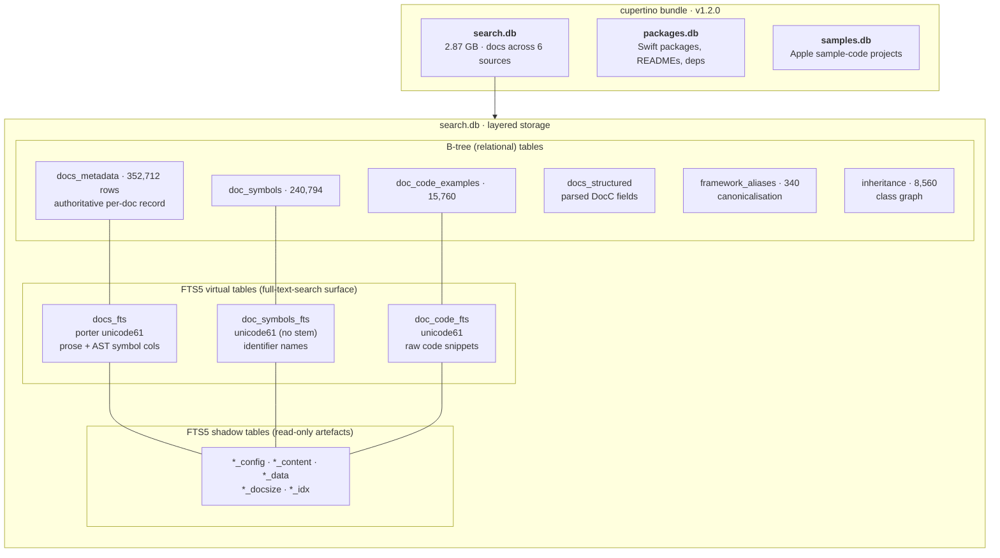
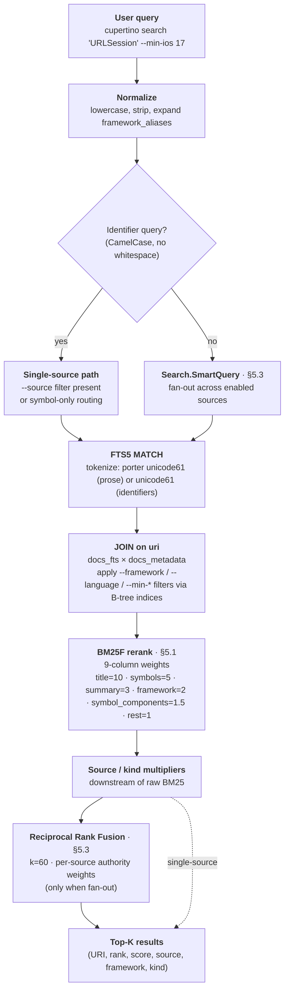

# The cupertino search database: design and methods

## Abstract

Cupertino is a documentation-search system for the Apple software development corpus, comprising Apple's framework reference documentation, the Swift Evolution proposal archive, the Swift Programming Language book, the Swift.org documentation, the Human Interface Guidelines, and legacy Apple Archive material. Because the corpus mixes long prose, short reference pages, fenced source code, and structured availability metadata, no single off-the-shelf indexing recipe produces acceptable ranked-retrieval quality across all document types. We describe here the database that backs cupertino's search functionality: an SQLite 3 instance using the bundled FTS5 full-text extension, augmented with a hand-designed relational schema, a multi-stage indexer pipeline incorporating Swift abstract-syntax-tree extraction (via SwiftSyntax) and Swift symbol-graph data (via `swift symbolgraph-extract`), and a query layer applying BM25F weighting, source-authority reciprocal rank fusion, and intent-based fetcher routing. The design choices reported here are motivated by the domain of the data being indexed, not by general-purpose IR considerations alone.

## 1. Introduction and domain

The corpus presents three properties that informed the database design:

1. **Heterogeneous granularity.** A single query may match a framework-root overview page (long prose, framework name in title), a method reference (one-paragraph stub, full type signature in title), a Swift Evolution proposal (multi-section technical specification), or a HIG design rationale (long prose, no Swift identifiers). Effective ranking requires per-column field weighting that recognises titles, code identifiers, and prose paragraphs as distinct signals.

2. **Code as first-class content.** Apple's DocC documentation embeds Swift code snippets that contain the very symbol names users search for. A purely prose-oriented full-text index treats `LazyVGrid` as an opaque token and cannot discover that `Lazy`, `VGrid`, or `Grid` as queries should retrieve it. Code-aware indexing requires parsing the snippets, extracting symbols, and exposing both the original identifiers and their CamelCase components to the ranker.

3. **Multi-source canonical-lookup pattern.** Most queries are of the form "where is X documented?" and have one canonical right answer (`Hashable` should rank `apple-docs://swift/hashable` first). However, the right answer may live in any of six sources of differing authority, and per-source BM25 score scales differ enough that naive top-N fusion is unreliable.

The remainder of this document describes how these three constraints were addressed.

## 2. Storage substrate

### 2.1 SQLite and FTS5

The database is **off-the-shelf SQLite 3.x as bundled with the Apple operating system** (`/usr/lib/libsqlite3.dylib`, exposed to Swift via `import SQLite3`). No custom SQLite build, no engine patches, and no third-party loadable extensions are used. The only SQLite extension activated is FTS5, which is itself bundled with the Apple SQLite distribution and requires no separate enablement.

Database files are opened via `sqlite3_open` and accessed through the C API directly from Swift code in `Packages/Sources/SearchSQLite/Search.Index.swift`. Concurrent access is mediated by a `Swift.Actor` (`Search.Index`) wrapping the connection handle; multiple readers concurrent with a single writer are supported via SQLite's write-ahead-log journaling mode (see Section 5.2).

### 2.2 Three-database split

The bundle distributed to end users comprises three SQLite files, each with its own schema:

| File | Domain | Size (v1.2.0 bundle) |
|---|---|---|
| `search.db` | Documentation pages from all six sources | 2.87 GB |
| `packages.db` | Swift package metadata, READMEs, dependency edges | varies |
| `samples.db` | Apple sample-code project metadata and source files | varies |

The split is functional, not normalisation-driven: each file is built by a separate `cupertino save` subcommand (`--docs`, `--packages`, `--samples`), can be shipped or skipped independently, and is queried by largely disjoint code paths. The remainder of this document concerns `search.db`. The other two follow analogous design patterns at smaller scale.



The diagram above zooms from the three-database bundle down into `search.db`'s three storage layers: relational B-tree tables (the authoritative per-row data), FTS5 virtual tables (the queryable text surface paired with selected B-tree columns), and the SQLite-managed shadow tables that hold the inverted-index artefacts of each FTS5 table.

## 3. Schema

The live schema definition is in `Packages/Sources/SearchSQLite/Search.Index.Schema.swift`. The current value of `PRAGMA user_version` is **18**. We describe each table by the role it plays in the indexing or query pipeline, deferring the detailed column lists to the schema file itself.

### 3.1 Relational (B-tree) tables

| Table | Cardinality at v1.2.0 | Function |
|---|---|---|
| `docs_metadata` | 352,712 | Authoritative per-document record. Primary key is the cupertino URI (`apple-docs://swiftui/view`). Holds source, framework, language, kind, content hash, last-crawl timestamp, word count, and the six availability columns (`min_ios`, `min_macos`, `min_tvos`, `min_watchos`, `min_visionos`, plus `implementation_swift_version` for evolution rows). All filter predicates on `cupertino search` resolve to constraints on this table. |
| `docs_structured` | parity with `docs_metadata` | Parsed DocC fields: title, abstract, declaration, overview, module, platforms, conformances, attributes. Decoupled from `docs_metadata` so the JSON-parse output can evolve without altering the primary index. |
| `framework_aliases` | 340 | Maps framework identifier (`appintents`), import name (`AppIntents`), display name (`App Intents`), and a comma-separated synonyms list (`nfc → corenfc`). Consulted at query time to canonicalise `--framework` arguments and to expand abbreviated user input. |
| `inheritance` | 8,560 | Class inheritance edges, one row per `(parent_uri, child_uri)` pair. Both `parent_uri` and `child_uri` are indexed so walks in either direction are equally efficient. Populated by reading Apple's DocC `relationshipsSections.inheritsFrom` / `inheritedBy` arrays from the corpus JSON (#274). |
| `doc_code_examples` | 15,760 | Code snippets extracted from doc pages. One row per snippet, with parent `doc_uri`, language, and intra-page position. |
| `doc_symbols` | 240,794 | One row per Swift symbol extracted from snippets. Columns: `name`, `kind`, source position (line, column), full signature, async/throws/public/static flags, `attributes` (e.g. `@MainActor`), `conformances`, `generic_params`, `generic_constraints`. Used both for symbol-targeted searches and as the substrate for the constraint-enrichment pipeline of Section 4.3. |
| `doc_imports` | small | Per-snippet import declarations, used for module-graph queries. |

A small number of FOREIGN KEY declarations exist on the secondary tables (`doc_symbols.doc_uri → docs_metadata.uri`) for documentation purposes. `PRAGMA foreign_keys` is not enabled at runtime: deletion is rare, and the supported recovery path for inconsistency is a full rebuild rather than referential repair.

### 3.2 FTS5 virtual tables

Four FTS5 virtual tables provide the full-text-search substrate. Each was chosen for a distinct role rather than as a uniform "search everything" surface:

| Virtual table | Columns | Tokenizer | Role |
|---|---|---|---|
| `docs_fts` | uri, source, framework, language, title, content, summary, symbols, symbol_components | `porter unicode61` | Primary user-facing FTS, holding both prose and AST-derived symbol columns. |
| `doc_symbols_fts` | name, signature, attributes, conformances | `unicode61` | Symbol-name FTS used by `cupertino search --source samples` and by the candidate-fetcher protocol when intent routing detects an identifier query. Porter stemming is omitted because Swift identifiers should not be stemmed. |
| `doc_code_fts` | code | `unicode61` | Full-text over raw code snippets (#81) for cross-page snippet search. |
| `sample_code_fts` | url, framework, title, description | `porter unicode61` | Sample-code metadata FTS, queried from `samples.db`-aware paths. |

The tokenizer choice is `porter unicode61` on prose-bearing tables (English-language stemming with Unicode case folding) and plain `unicode61` on identifier-bearing tables. This split is intentional: stemming `URLSession` to `urlsess` would destroy the high-weight ranking signal that motivates the `symbols` column.

Each FTS5 table is paired with the standard set of shadow tables (`*_config`, `*_content`, `*_data`, `*_docsize`, `*_idx`), which are read-only artefacts of the FTS5 implementation and not directly queried.

### 3.3 The `symbols` and `symbol_components` columns

Two of the columns in `docs_fts` exist solely to expose AST-extracted information to the BM25 ranker, and warrant explicit description.

`docs_fts.symbols` holds the verbatim names of Swift types, methods, and other declarations that appeared in code snippets on the page being indexed. The names are extracted by the cupertino-internal `ASTIndexer` package (Section 4.2) and stored as a space-separated string per row. At query time the column receives a BM25F weight of 5.0, the second-highest weight in the schema, so an exact match on a Swift type name strongly biases ranking toward the page that defines the type.

`docs_fts.symbol_components` holds the same identifiers expanded into their constituent CamelCase parts. The expansion is performed by `Search.Index.CamelCaseSplitter` (#77), which applies an acronym-aware rule:

- `LazyVGrid` → {`Lazy`, `VGrid`, `Grid`}
- `URLSession` → {`URL`, `Session`}
- `JSONDecoder` → {`JSON`, `Decoder`}
- `HTTPSCookieStorage` → {`HTTPS`, `Cookie`, `Storage`}

Single-letter fragments are dropped. The column receives BM25F weight 1.5, low enough not to compete with the high-precision `symbols` column for exact-name queries, but high enough that a partial query (`Cookie`, `Grid`, `Decoder`) retrieves the relevant pages.

This two-column design separates precision-of-name from recall-of-fragment as independent ranking signals, in lieu of a custom tokenizer that would conflate them.

## 4. Indexer pipeline

The transition from on-disk raw corpus to a populated `search.db` is a multi-stage pipeline executed by `cupertino save --docs`. The stages are described in execution order.

### 4.1 Raw corpus and source-specific strategies

The on-disk input is a directory tree (Apple's DocC render-JSON format for apple-docs, plain markdown for swift-evolution, etc.) produced by a separate crawler step (`cupertino fetch`) or shipped from the sibling git repository `cupertino-docs`. One subdirectory per source is read by a dedicated source-indexing strategy (`Search.Strategies.AppleDocs`, `Search.Strategies.SwiftEvolution`, etc.), each implementing a common `SourceIndexingStrategy` protocol. The strategies decouple source-specific parsing from the shared insertion pipeline.

### 4.2 Code-aware symbol extraction via SwiftSyntax

For each documentation page that contains code snippets, the `ASTIndexer` package (`Packages/Sources/ASTIndexer/`) parses each snippet using Apple's `swift-syntax` library (`SwiftParser.Parser.parse(source:)`). A custom `DeclarationVisitor` walks the resulting syntax tree and emits a `Symbol` value for every declaration encountered. The `SymbolKind` enumeration enumerates sixteen declaration kinds (`class`, `struct`, `enum`, `actor`, `protocol`, `extension`, `function`, `method`, `initializer`, `property`, `subscript`, `typealias`, `associatedtype`, `case`, `operator`, `macro`).

Each emitted `Symbol` carries the full declaration signature (where applicable), a set of declaration modifier flags (`isAsync`, `isThrows`, `isPublic`, `isStatic`), a list of `attributes` (Swift attributes such as `@MainActor`, `@Observable`), a list of `conformances`, and, for generic declarations, both the `generic_params` list and the `generic_constraints` list. The corresponding rows are inserted into `doc_symbols`; the symbol names are concatenated into the `docs_fts.symbols` column for the parent page; the import declarations are inserted into `doc_imports`.

The choice to use `swift-syntax` rather than a regex-based heuristic is motivated by the precision requirements of symbol-targeted search: a regex cannot reliably distinguish a `Hashable` type-name reference from a `Hashable` conformance constraint from a `Hashable` property name without false positives, and per-query precision is bounded by the precision of the underlying tokens.

### 4.3 Constraint enrichment via symbol graphs

A second source of structured metadata is the **Swift symbol graph** produced by `xcrun swift symbolgraph-extract`. This tool, distributed with the Swift compiler, emits per-module JSON describing every public API surface (types, methods, generic parameters, constraints) compiled from the SDK headers. The cupertino sibling repository `cupertino-symbolgraphs` runs the extractor against every framework slug that appears in the apple-docs corpus and publishes the resulting symbol-graph corpus as a GitHub Release per Swift toolchain version.

The cupertino-internal package `AppleConstraintsKit` (`Packages/Sources/AppleConstraintsKit/`) consumes the symbol-graph corpus offline (one-time per Swift toolchain) and emits `apple-constraints.json`, a compact mapping from `docURI → constraint list`. We chose a hand-rolled minimal `Decodable` projection of the symbol-graph format rather than depending on Apple's `swift-docc-symbolkit`, both to avoid an additional network dependency and because the symbol-graph files are large (~456 MB for SwiftUI alone) and decoding only the fields we consume (`pathComponents`, `kind.identifier`, `swiftGenerics.constraints`) is materially faster.

The three-iteration enrichment pipeline (#759) operates on `doc_symbols.generic_constraints` in the following order:

- **Iteration 1** (during initial indexing, Section 4.2): the AST extractor captures constraints declared on each page's own visible declaration, both inline (`<T: View>`) and in `where` clauses.

- **Iteration 3** (`Search.Index.applyAppleStaticConstraints`): if `apple-constraints.json` is available at the standard path, its authoritative entries override `doc_symbols.generic_constraints` for matching `(doc_uri, symbol_name)` pairs. This fills constraints that the AST extractor could not recover because the constraint was declared on a parent type whose source did not appear on the doc page. Iteration 3 is run before iteration 2 by design: the authoritative override should establish the high-confidence state before inheritance propagation operates on it.

- **Iteration 2** (`Search.Index.propagateConstraintsFromParents`): a graph walk over the type hierarchy that propagates parent-level constraints down to bare-generic method declarations. For example, `NavigationLink`'s init signature carries `Destination` but no constraint clause; iteration 2 inherits the struct-level `Destination: View` constraint onto the init row, making it retrievable by constraint-aware queries.

When `apple-constraints.json` is absent (as on machines without a recent `cupertino-symbolgraphs` checkout), iteration 3 is a silent no-op and only iterations 1 and 2 populate `generic_constraints`. The v1.2.0 ship bundle had iteration 3 active and contains 24,827 populated constraint rows out of 240,794 doc_symbols (10.3%).

### 4.4 Door dedup

Each candidate `(uri, content_hash)` pair entering the indexer is compared against existing rows. Three tiers of duplicate are recognised (#588):

- **Tier A** (byte-identical): URI matches, content hash matches. The candidate is silently dropped.
- **Tier B** (title drift): URI matches, title matches with normalisation drift (whitespace, casing). The candidate is logged and dropped; these are typically crawl artefacts.
- **Tier C** (genuine collision): URI matches, content differs in non-trivial ways. The candidate is **always a hard error** in the audit log. Tier C must be zero for the Definition of Done; a non-zero Tier C indicates the corpus contains two distinct documents claiming the same canonical URI, which would break read-by-URI semantics.

The v1.2.0 ship bundle records 0 Tier-A, 3 Tier-B, and 0 Tier-C events across 351,495 successfully indexed apple-docs rows.

### 4.5 Garbage rejection

Two filters reject candidates at the door before insertion (#284, #588):

- **HTTP-error templates**: pages whose title belongs to a known set of error templates (`Forbidden`, `403 Forbidden`, `JavaScript Required`, etc.) are rejected. These appear when the crawler captured an authentication-required or rate-limited response instead of the intended document body.
- **Placeholder titles**: pages whose title matches a placeholder pattern indicating that the corpus parser failed to extract a real title are rejected.

The v1.2.0 ship bundle records 0 HTTP-template rejections, 0 JavaScript-required rejections, and 11 placeholder-title rejections.

### 4.6 Inheritance graph construction

After per-document parsing concludes, a second pass walks the cached DocC JSON for `relationshipsSections` entries of type `inheritsFrom` or `inheritedBy`, emitting one `(parent_uri, child_uri)` row in `inheritance` per edge (#274). The PRIMARY KEY on the pair prevents duplicate edges when the same relationship is described from both directions. The resulting graph is queried at runtime to support ancestor and descendant walks.

### 4.7 Sidecar writes and atomic rename

The entire save operation writes to `search.db.in-flight` rather than `search.db` directly (#673 Phase G). On successful completion, the in-flight file is atomically renamed over the prior `search.db`; on crash or kill, the prior file remains intact and queryable. The version of the indexer binary shipped via Homebrew supports this mode; older binaries do not, in which case the database is written in-place and a mid-save kill produces an incomplete file.

## 5. Query layer

The query path is implemented in `Packages/Sources/SearchSQLite/Search.Index.Search.swift`. Three components warrant explicit treatment.



The diagram traces a query from raw input to ranked output. Two routing decisions matter: whether the query looks like a Swift identifier (which prunes the fan-out to symbol-preferred sources), and whether the user passed `--source` (which short-circuits the RRF stage entirely). Filter predicates resolve to B-tree index lookups on `docs_metadata`, not to FTS5 scans.

### 5.1 BM25F field weighting

The single SQL expression that determines ranking is:

```sql
bm25(docs_fts, 1.0, 1.0, 2.0, 1.0, 10.0, 1.0, 3.0, 5.0, 1.5) AS rank
```

The nine weights map to the FTS5 column order. The chosen values are reproduced below with their rationale.

| Column | Weight | Rationale |
|---|---|---|
| `uri` | 1.0 | Background signal; URIs are slugified and typically redundant with title content. |
| `source` | 1.0 | Background; coarse-grained filter, low term-frequency value. |
| `framework` | 2.0 | Mild boost so framework-name queries (`SwiftUI`) bias toward the framework root. |
| `language` | 1.0 | Background. |
| `title` | **10.0** | Dominant. Most queries are noun-phrase lookups whose target should match a document title. |
| `content` | 1.0 | Largest column by length; left at baseline so length-normalised term frequency does not dilute the high-weight columns. |
| `summary` | 3.0 | Boosted; summaries are short and topical, with high precision. |
| `symbols` | **5.0** | High weight on AST-extracted symbol names enables canonical type pages to dominate symbol-name queries. |
| `symbol_components` | 1.5 | Light recall boost from CamelCase splits without competing with `symbols` for exact-name matches. |

FTS5 returns negative BM25 scores (lower is better match); cupertino preserves this sign convention through the query layer and applies kind- and source-based multiplicative corrections downstream of the raw FTS5 score (Section 5.3).

### 5.2 Filter and JOIN strategy

User-supplied filters (`--source`, `--framework`, `--language`, `--min-ios`, `--min-macos`, etc.) resolve to additional `WHERE` clauses on a join between `docs_metadata` and `docs_fts` keyed on `uri`. The dedicated B-tree indices on `docs_metadata` (e.g., `idx_framework`, `idx_min_ios`, `idx_language`) ensure these filters are satisfied by index lookup rather than by a virtual-table scan, which FTS5 does not support natively.

Symbol-attribute filters (e.g., "find all `@MainActor` properties") resolve to predicates on `doc_symbols`, joined back to `docs_metadata` and `docs_fts` for ranking and result rendering.

### 5.3 Cross-source rank fusion

When `--source` is not specified, the search path is `Search.SmartQuery` (`Packages/Sources/SearchAPI/SmartQuery.swift`), which composes one ranked candidate list from each enabled source and fuses them using **reciprocal rank fusion** (Cormack, Clarke, and Büttcher, 2009):

```
fused_score(d) = Σ_{s ∈ sources(d)} sourceWeight(s) / (k + rank_s(d))
```

with `k = 60` (the Cormack-Clarke-Büttcher default; the formula is robust to k in [10, 100]) and per-source authority weights:

| Source | Weight |
|---|---|
| `apple-docs` | 3.0 |
| `swift-evolution` | 1.5 |
| `packages` | 1.5 |
| `swift-book` | 1.0 |
| `swift-org` | 1.0 |
| `samples` | 1.0 |
| `apple-archive` | 0.5 |
| `hig` | 0.5 |

The authority weights (#254 Option B) break the tie that arises when two sources both have a rank-1 result; without weighting, the per-source rank-1 contribution is identical (`1/(60+1) ≈ 0.0164`) and the chosen result depends on dictionary order. Apple-docs's elevated weight ensures that canonical Apple platform queries return the canonical Apple-docs hit when one exists, while preserving fan-out to lower-authority sources for queries that have no apple-docs answer.

The choice of RRF over a unified BM25 over all sources is motivated by the per-source incompatibility of raw BM25 scores: the score magnitudes depend on per-source vocabulary, average document length, and column count, none of which are commensurable across `apple-docs` and `hig` even when the underlying ranker is identical. Rank-based fusion is robust to that scale mismatch by construction.

`SmartQuery` further applies **intent routing** (#254): queries that match the pattern of a Swift identifier (CamelCase, no whitespace) are routed only to `symbolPreferredSources` (`apple-docs`, `swift-evolution`, `packages`), to avoid burying canonical symbol answers under prose-heavy sources that may match the query as a substring.

## 6. Concurrency and tuning

The `Search.Index` Swift actor serialises all writes to the database connection. Read operations from `cupertino search` and `cupertino serve` open additional connections and operate independently. Cross-connection concurrency relies on the WAL journaling mode.

Per-connection PRAGMAs set on open:

| PRAGMA | Value | Purpose |
|---|---|---|
| `busy_timeout` | 5000 ms | Allow concurrent `cupertino search` to proceed during a `cupertino save` rather than fail immediately on transient lock contention. |
| `journal_mode` | `WAL` | Multi-reader / single-writer concurrency without writer-blocks-reader behaviour (#236). |
| `synchronous` | `NORMAL` | Standard pairing with WAL; loses durability only of the most recent commit on power loss, acceptable for a rebuildable index. |
| `journal_size_limit` | 67108864 (64 MB) | Bound the WAL sidecar against pathological reader-starvation growth. |

An experimental branch (#800) introduces three additional PRAGMAs (`cache_size = -262144`, `temp_store = MEMORY`, `mmap_size = 1 GiB`) and configures all four FTS5 virtual tables with `automerge = 0` plus a final `INSERT INTO ft(ft) VALUES('optimize')` at end-of-save. These changes reduce indexing wall time by approximately a factor of two on the full apple-docs corpus by deferring all FTS5 segment merges to a single end-of-save batch. They are query-equivalent and do not alter result semantics.

## 7. Schema evolution

`PRAGMA user_version` is the load-bearing schema-version flag. Migrations are imperatively defined in `Packages/Sources/SearchSQLite/Search.Index.Migrations.swift` and executed at database open time. A binary opening a database with `user_version > schemaVersion` refuses to read it ("rebuild required"). A binary opening one with `user_version < schemaVersion` runs the migration chain.

Selected milestones:

| Version | Change |
|---|---|
| 1 | Initial schema |
| 4 | Added `source` column to `docs_fts` and `docs_metadata`; enables source-axis filtering |
| 5 | Added `language` column (breaking change for prior consumers) |
| 12 | Added `symbols` column to `docs_fts` (#192 section D); enables BM25F to weight AST-extracted symbol names |
| 17 | Pre-#789 baseline |
| 18 | Removed `packages` and `package_dependencies` tables; canonical package store relocated to `packages.db` (#789) |

The end-user bundle carries its own constant `Shared.Constants.App.databaseVersion`, separate from `PRAGMA user_version`, which the CLI consults to determine when to recommend that the user re-run `cupertino setup`.

## 8. Performance characteristics

Empirical measurements on the v1.2.0 apple-docs corpus (351,495 indexed rows) on an Apple M4 (base) machine:

- **Database size after full save**: 2.87 GB
- **Wall time for a full `cupertino save --docs`**: approximately 7 hours with the develop-tip binary, approximately 6 hours 20 minutes with the #800 experimental A+B mitigations.
- **Indexing rate decay**: the per-row insertion cost scales super-linearly in the number of already-indexed rows. Empirical fits give `T ∝ N^2.126` for the develop-tip binary and `T ∝ N^1.95` for the #800 variant. The dominant cost is FTS5 segment-merge work, which compounds as N grows.
- **Post-optimisation FTS5 storage layout**: without `optimize`, `docs_fts` carries documents distributed across approximately twelve segment buckets; with the #800 final `optimize`, distribution collapses to two buckets.
- **Query latency at v1.2.0 corpus size**: 145 ms (short identifier queries such as `@MainActor`) to 510 ms (multi-word prose queries such as `actor reentrancy`) for the binary in its default configuration, with negligible cold-vs-warm difference for the cupertino binary on a system with adequate page cache.

The rate-decay measurements and the FTS5 segment-merge mechanism are documented at length in `docs/perf/2026-05-19-fts5-bulk-load-research.md` and `docs/fun-facts.md`.

## 9. Design choices not taken (and architectural invariants)

Several alternatives were considered and rejected. The first invariant in particular is not a preference but a hard constraint on the system: **cupertino remains a file-based, embedded database**. No server, no SaaS, no remote query path. The remaining items are negative design choices made within that constraint.

- **Embedded, file-based deployment is an architectural invariant.** The entire system is delivered as one SQLite file per database (`search.db`, `packages.db`, `samples.db`) shipped via GitHub Releases and queried in-process. No server is deployed, no network call is made on the query path, no SaaS dependency exists. This constraint follows from the project's offline-first goal: the system must be fully functional on a developer machine with no network. Migrations to a hosted backend, a client-server architecture, or a vector-database backend are out of scope, not future work.

- **No vector embeddings.** The system performs only lexical search. No HNSW, IVF, or embedding columns are present. The semantic-search affordances offered by the system (RRF, intent routing, symbol-component recall) are all classical IR mechanisms. The motivating concerns are cost, latency, reproducibility, and the absence of a clear quality win on the canonical-lookup workload that dominates cupertino's queries. The position is documented in `docs/PRINCIPLES.md`.

- **No third-party SQLite extensions.** No `sqlite-vss`, no `sqlite-vec`, no `sqlite-utils` enhancements, no loadable extensions beyond bundled FTS5. The system is designed to run on any unmodified Apple SQLite installation.

- **No third-party Swift symbol-graph dependencies.** Apple's `swift-docc-symbolkit` was considered for symbol-graph parsing in Section 4.3 but rejected in favour of a hand-rolled minimal `Decodable` projection, both because the package would add a network dependency at build time and because its exhaustive model decodes hundreds of fields that the constraint pipeline does not consume.

- **No heavy schema normalisation.** Availability columns are denormalised inline on `docs_metadata` rather than factored into a separate `availabilities` table. The trade-off is read simplicity and query speed (a single JOIN cardinality bound by `docs_metadata`) at the cost of disk-space economy. The cost is acceptable for a read-mostly index.

- **No runtime enforcement of foreign keys.** The few `FOREIGN KEY` declarations present in the schema document intended invariants but are not enforced by `PRAGMA foreign_keys`. The supported recovery from referential inconsistency is a full database rebuild.

## 10. Related work

The design space of documentation search systems spans several distinct approaches. We summarise the systems most directly comparable to cupertino, identifying the axis on which each differs, in order to situate the design choices reported above.

### 10.1 Dash docsets (Kapeli)

Dash is a macOS documentation browser whose docset format is the closest precedent to cupertino in deployment shape: each docset is a SQLite database shipped with HTML pages, queried offline without a server. The public format documentation specifies a schema of the form:

> `CREATE TABLE searchIndex(id INTEGER PRIMARY KEY, name TEXT, type TEXT, path TEXT);`
> `CREATE UNIQUE INDEX anchor ON searchIndex (name, type, path);`

with the note that "full-text search is disabled for docsets by default" (Kapeli, *Docset Generation Guide*).

This design indexes only the **identifier name**, the **declaration kind** (`type`), and the **HTML file path** to load. Search is a B-tree lookup by name; ranking, where present, is alphabetic or by source order. There is no per-column field weighting, no AST-level enrichment, no inheritance graph, and no cross-source rank fusion because each docset is a self-contained corpus for one technology.

Cupertino's schema can be viewed as a strict superset of Dash's: the `name` / `type` / `path` triple is implicit in cupertino's `(uri, kind, file_path)` columns on `docs_metadata`. The remaining tables (`docs_fts`, `doc_symbols`, `inheritance`, `framework_aliases`, `doc_code_examples`, `doc_imports`) are additions justified by the multi-source, ranked, code-aware queries that cupertino targets and that Dash does not.

### 10.2 Algolia DocSearch (and the SaaS lexical-search class generally)

Algolia DocSearch is a hosted documentation-search service used by a large number of open-source projects' documentation sites. Architecturally it comprises a crawler that scrapes the documentation site on a weekly schedule and a JavaScript frontend that issues queries to Algolia's hosted search backend (Algolia, *DocSearch overview*). The ranking algorithm and index structure are commercial and not publicly specified. The same class includes Typesense and MeiliSearch, both server-deployed lexical engines with BM25-family ranking.

Cupertino differs on operational shape rather than IR substance: a single SQLite file shipped to the end user, queried in-process, with no network call and no per-query latency-floor from a server hop. The trade-off is index update cadence (cupertino requires a bundle download per release; SaaS systems re-crawl weekly without user action) against offline availability and cost.

### 10.3 Zoekt (Sourcegraph)

Zoekt is a code-search engine designed for source code rather than documentation, with a substantively different indexing substrate. Per its public documentation, Zoekt uses "trigram indexing combined with syntactic parsing" to support "fast substring and regexp matching on source code" and ranks results using "code-related signals like whether the match is on a symbol" (Sourcegraph, *Zoekt README*).

The trigram substrate enables substring queries (e.g., `parse` finds `parseSource`, `URLParse`, `parser`) that a BM25 word-token index cannot answer without explicit n-gram tokenization. The symbol-awareness is fed by Universal ctags, a language-agnostic tag extractor.

Cupertino addresses analogous concerns through different mechanisms: substring-like recall comes from the dedicated `symbol_components` column populated by the CamelCase splitter (Section 3.3), and symbol awareness comes from AST extraction via SwiftSyntax (Section 4.2) rather than ctags. The design choice is motivated by domain: Zoekt indexes arbitrary source repositories across many languages; cupertino indexes Apple Swift documentation specifically, and can afford a Swift-specific AST parser.

### 10.4 DevDocs and other client-side docs browsers

DevDocs (devdocs.io) is a browser-based documentation aggregator that maintains a client-side index in IndexedDB and performs fuzzy / prefix matching on identifier names. We were unable to retrieve the upstream technical documentation directly for citation, but the model is broadly that of a name-keyed lookup augmented with substring matching, comparable to Dash in shape and not to cupertino in capability.

### 10.5 Apple's own documentation search

Apple's developer.apple.com search backend is closed-source. The Xcode in-app Quick Help and Developer Documentation viewer use an internal indexer whose format is not publicly documented. Comparison is therefore limited to user-facing behaviour. Cupertino's design draws on observed gaps in that user-facing behaviour (e.g., poor cross-source fan-out into Swift Evolution and HIG from a single Apple-docs query) but does not borrow from any specified Apple implementation.

### 10.6 PostgreSQL full-text search

For completeness: PostgreSQL provides full-text search via `tsvector` / `tsquery` with ranking functions `ts_rank` and `ts_rank_cd`. The architecture is comparable to SQLite FTS5 in substrate (inverted index, per-column weighting via the `setweight` function) but is server-deployed and not used, to our knowledge, by any major Apple-platform documentation system. The choice between PostgreSQL FTS and SQLite FTS5 for a cupertino-class system is dominated by deployment shape (embedded vs server) rather than IR capability.

### 10.7 Summary of comparison

The following table positions cupertino against the comparable systems on the axes that matter for documentation search:

| System | Substrate | Ranking | Code-awareness | Multi-source fusion | Deployment |
|---|---|---|---|---|---|
| Dash docsets | SQLite B-tree on (name, type, path) | Alphabetic | None | Per-docset only | Embedded |
| Algolia DocSearch | Algolia (proprietary) | Proprietary | None disclosed | None | SaaS |
| Zoekt | Trigram + ctags | Code signals + symbol-ness | Yes (ctags-based, language-agnostic) | Per-repo only | Server |
| DevDocs | Client-side (IndexedDB) | Name-prefix + fuzzy | None | Per-docset only | Embedded (browser) |
| PostgreSQL FTS | Inverted index | `ts_rank` / `ts_rank_cd` | None | None | Server |
| **Cupertino** | **SQLite + FTS5** | **BM25F (9 weights) + kind / source multipliers + RRF** | **Yes (SwiftSyntax AST + symbolgraph)** | **Yes (per-source weighted RRF)** | **Embedded** |

No prior system to our knowledge combines (a) embedded deployment, (b) BM25F field weighting on AST-extracted code identifiers, (c) multi-source weighted reciprocal rank fusion, and (d) authoritative-symbol-graph constraint enrichment within a single open-source pipeline. The combination is motivated by the specific structure of the Apple developer documentation corpus and is not a general claim about IR design.

## 10.8 Search-quality measurement

The architecture would be incomplete without a way to claim "the new build is better" or "no regression" from rigorous measurement rather than anecdote. Cupertino ships its evaluation harness alongside the indexer.

**Methodology design:** `docs/design/search-quality-eval.md` (Cranfield-paradigm; 8 query classes with class-appropriate metrics; Phase 1 single-system mode + Phase 1.x per-class baselines + Phase 1.7 agent-end-to-end + Phase 1.8 version-diff comparison).

**Harness:** `scripts/eval/search-quality-phase1.py` invokes `cupertino search --format json` against a `(binary, search.db)` pair for each query in a fixed corpus, parses the top-10 URI list, scores against per-query right-answer regexes, computes P@1 / P@5 / MRR / NDCG@10. Paired comparison mode: same corpus against two `(binary, db)` pairs, with Wilcoxon signed-rank on per-query reciprocal rank + McNemar 2 × 2 on the rank-1 outcome + bucketed query-list deltas (Added / Removed / Fixed / Degraded / Unchanged / Both-suboptimal). Sibling harness `search-quality-phase1-extended.py` extends to multi-corpus paired comparison (canonical-V2 + deprecation-pair corpora). Both deterministic — two runs against the same inputs produce byte-identical per-query ranks.

**Audits:** `docs/audits/search-quality-*-v1.2.0.md`. Seven absolute baselines (one per query class) + three paired v1.1.0 → v1.2.0 version-diff audits land in this folder. The dashboard at `docs/dashboards/` auto-derives every card on the live site (https://cupertino.aleahim.com/) from the audit MDs via `regen-all.sh`; no per-audit hardcoding.

**Headline result for v1.2.0:** rank-1 accuracy on the 50-query canonical-lookup corpus went from 52% (v1.1.0) to 92% (v1.2.0). McNemar two-sided p = 2 × 10⁻⁶; Wilcoxon one-sided p (v1.2.0 > v1.1.0) = 2.5 × 10⁻⁵. Zero queries regressed across 110 paired queries on three independent corpora. Full breakdown in `docs/release-writeup-v1.2.0.md`.

**Why this lives in the architecture doc:** the harness is a fundamental piece of cupertino's design discipline. Every ranking change must justify itself against the existing baselines via this paired-comparison shape, or document why no regression test applies. The dashboard makes that disciplined comparison visible.

## 11. Where in the code

| Concern | Path |
|---|---|
| Schema definition | `Packages/Sources/SearchSQLite/Search.Index.Schema.swift` |
| Migrations | `Packages/Sources/SearchSQLite/Search.Index.Migrations.swift` |
| Connection open, PRAGMAs | `Packages/Sources/SearchSQLite/Search.Index.swift` |
| Query implementation, BM25F weights | `Packages/Sources/SearchSQLite/Search.Index.Search.swift` |
| Filter-based search | `Packages/Sources/SearchSQLite/Search.Index.SearchByAttribute.swift` |
| CamelCase splitter | `Packages/Sources/SearchSQLite/Search.Index.CamelCaseSplitter.swift` |
| Cross-source RRF fan-out | `Packages/Sources/SearchAPI/SmartQuery.swift` |
| Candidate-fetcher protocol | `Packages/Sources/SearchSQLite/CandidateFetcher.swift` |
| Authoritative constraint pipeline (iter-3) | `Packages/Sources/SearchSQLite/Search.Index.AppleStaticConstraints.swift` |
| Inheritance walk (iter-2) | `Packages/Sources/SearchSQLite/Search.Index.HierarchyConstraints.swift` |
| AST extraction (iter-1 substrate) | `Packages/Sources/ASTIndexer/` |
| Symbol-graph constraint extraction | `Packages/Sources/AppleConstraintsKit/` |
| Indexer orchestration | `Packages/Sources/Indexer/` and `Packages/Sources/SearchAPI/Search.IndexBuilder.swift` |
| Source-specific strategies | per-source SPM packages: `Packages/Sources/{HIGStrategy,AppleDocsSource,AppleArchiveStrategy,SampleCodeStrategy,SwiftEvolutionStrategy,SwiftOrgStrategy}/Search.Strategies.*.swift` (AppleDocsSource renamed from AppleDocsStrategy in #1008 as the first per-source SPM target) |
| Door dedup and garbage filter | per-source strategy classes |
| Three-database save command | `Packages/Sources/CLI/Commands/CLIImpl.Command.Save.swift` |
| Phase 1 search-quality harness (single-arm + paired) | `scripts/eval/search-quality-phase1.py` |
| Phase 1 extended (multi-corpus paired) | `scripts/eval/search-quality-phase1-extended.py` |
| Audit MDs (per-class baselines + version-diff) | `docs/audits/search-quality-*-v1.2.0.md` |
| Dashboard renderer (auto-derived from audit MDs) | `docs/dashboards/_render-index-dashboard.py` + `regen-all.sh` |

## 12. Related documentation

- `docs/ARCHITECTURE.md`: package structure of the broader cupertino codebase.
- `docs/PRINCIPLES.md`: the engineering principles (lossless URIs, collisions handled at the door, garbage filtered at input, 10x scale headroom) that constrain the indexer pipeline.
- `docs/package-import-contract.md`: the strict-DI import contract between cupertino's Swift targets.
- `docs/audits/release-readiness-v1.2.0.md`: a worked example of schema-shape and count-shape validation.
- `docs/design/search-quality-eval.md`: the Cranfield-paradigm IR-evaluation methodology used to compare two `search.db` builds quantitatively. Implements §G1-G4 via `scripts/eval/search-quality-phase1.py`.
- `docs/design/anti-hallucination-eval.md`: Phase 1.7 design (forward-looking) — measures whether an AI agent given cupertino's top-K results actually produces correct Swift code.
- `docs/release-writeup-v1.2.0.md`: long-form v1.2.0 release narrative — what changed, where the gains came from (#77, #192, #254, #858), what v1.2.0 still gets wrong, how the measurement works, honest disclosure of the canonical-V2 corpus's one rank-shift case.
- `docs/perf/2026-05-19-fts5-bulk-load-research.md`: deferred-work note on FTS5 bulk-load mitigations.
- `docs/fun-facts.md`: empirical indexing-throughput curve.

## References

- Robertson, S. E., & Walker, S. (1994). Some simple effective approximations to the 2-Poisson model for probabilistic weighted retrieval. *Proceedings of SIGIR 1994*. (BM25, the basis of FTS5's `bm25(...)` function.)
- Cormack, G. V., Clarke, C. L. A., & Büttcher, S. (2009). Reciprocal rank fusion outperforms Condorcet and individual rank learning methods. *Proceedings of SIGIR 2009*. (The default `k = 60` and the RRF formula adopted in Section 5.3.)
- SQLite FTS5 documentation: `https://sqlite.org/fts5.html`.
- Apple `swift-syntax`: `https://github.com/swiftlang/swift-syntax`. (Substrate for ASTIndexer.)
- Apple `swift symbolgraph-extract` (Swift toolchain). (Substrate for cupertino-symbolgraphs.)
- Manning, C. D., Raghavan, P., & Schütze, H. (2008). *Introduction to Information Retrieval*. Cambridge University Press. (BM25F field weighting in Section 5.1, evaluation methodology referenced in `docs/audits/search-quality-eval-methodology.md`.)
