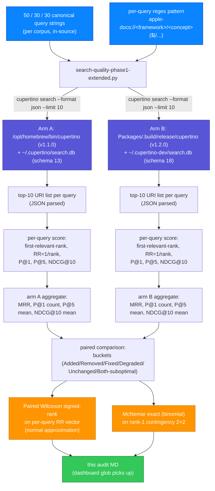

# Search-quality version diff: v1.1.0 → v1.2.0 (canonical-lookup-V2 (independent corpus))

**Date:** 2026-05-21
**Status:** Mixed
**Headline:** +8 / 30 queries newly rank-1
**Corpus:** canonical-lookup-V2 (independent corpus) — independent of `search-quality-versiondiff-v1.1.0-to-v1.2.0.md`'s 50-query corpus (zero overlap, different queries chosen to cross-validate)
**Arm A:** v1.1.0 (brew) — `/opt/homebrew/bin/cupertino` × `/Users/mmj/.cupertino/search.db` (v13, 285,735 docs)
**Arm B:** v1.2.0 (dev) — `/Volumes/Code/DeveloperExt/public/cupertino/Packages/.build/release/cupertino` × `/Users/mmj/.cupertino-dev/search.db` (v18, 352,712 docs)
**Methodology:** `docs/design/search-quality-eval.md` Phase 1 (Class A + B, paired-comparison mode)
**Harness:** `scripts/eval/search-quality-phase1-extended.py`
**Universal rule:** `../private/mihaela-agents/Rules/universal/search-quality-eval.md`

This is a cross-validation corpus. The v1.1.0 → v1.2.0 claim ("v1.2.0 is better") is being independently re-verified with a different fixed query set so the result isn't a quirk of the first corpus. The two corpora share zero queries.

---

## Aggregate

| Metric | v1.1.0 (brew) | v1.2.0 (dev) | Delta |
|---|---|---|---|
| N queries | 30 | 30 | — |
| **MRR** | **0.7974** | **0.9367** | **+0.1393** |
| P@1 | 0.7000 (21 / 30) | 0.9333 (28 / 30) | +0.2333 |
| P@5 (mean) | 0.3000 | 0.3733 | +0.0733 |
| NDCG@10 | 1.3183 | 1.8486 | +0.5303 |

**Headline:** 8 / 30 queries newly rank-1 in v1.2.0; 1 regression.

---

## Paired statistical tests

**Paired Wilcoxon signed-rank on per-query RR (B vs A):**

- N_nonzero = 10
- W+ = 44.50, W− = 10.50
- Two-sided p = 0.083131
- One-sided p (v1.2.0 > v1.1.0) = 0.041566

**McNemar on rank-1 outcome:**

|  | v1.2.0 rank-1 | v1.2.0 not rank-1 |
|---|---|---|
| **v1.1.0 rank-1** | 20 (concordant +) | 1 (regression) |
| **v1.1.0 not rank-1** | 8 (improvement) | 1 (concordant −) |

- McNemar exact (binomial), two-sided p = **0.039062**

---

## Buckets

| Bucket | Count | Queries |
|---|---|---|
| **Added** | **1** | `Range` |
| **Removed** | **1** | `Continuation` |
| **Fixed** | **7** | `Numeric`, `Strideable`, `withUnsafePointer`, `UUID`, `Locale`, `TimeZone`, `Image` |
| **Degraded** | **1** | `Iterator (rank 7 → rank 10)` |
| Unchanged (both rank-1) | 20 | — |
| Both still suboptimal | 0 | — |

---

## Cross-validation note

If this audit's headline + significance numbers agree directionally with `search-quality-versiondiff-v1.1.0-to-v1.2.0.md`'s (the original 50-query corpus), the v1.2.0 > v1.1.0 claim is robust to corpus choice. If they disagree, we have a corpus-dependent result and need to investigate.

---

## Pipeline

