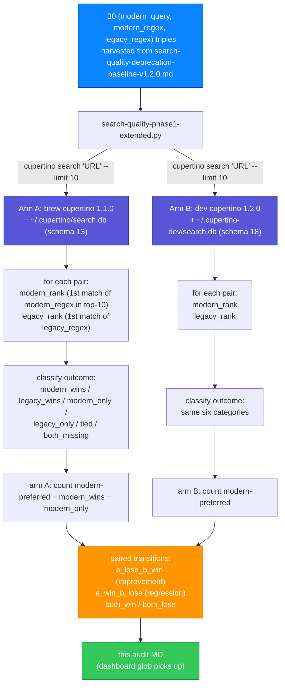

# Search-quality version diff: v1.1.0 → v1.2.0 (deprecation pairs)

**Date:** 2026-05-21
**Status:** Strong
**Headline:** modern-wins rate 90.00% → 100.00%
**Corpus:** 30 (modern, legacy) Foundation + Swift-stdlib pairs harvested from `docs/audits/search-quality-deprecation-baseline-v1.2.0.md`
**Arm A:** v1.1.0 (brew) — `/opt/homebrew/bin/cupertino` × `/Users/mmj/.cupertino/search.db` (v13, 285,735 docs)
**Arm B:** v1.2.0 (dev) — `/Volumes/Code/DeveloperExt/public/cupertino/Packages/.build/release/cupertino` × `/Users/mmj/.cupertino-dev/search.db` (v18, 352,712 docs)
**Methodology:** `docs/design/search-quality-eval.md` Phase 1.1 (Class C deprecation-aware, paired-comparison mode)
**Harness:** `scripts/eval/search-quality-phase1-extended.py`

For each (query, modern_uri, legacy_uri) triple: run `cupertino search "<query>" --limit 10`, classify the outcome as `modern_wins` (modern rank < legacy rank), `legacy_wins`, `tied`, `modern_only` (only modern in top-10), `legacy_only`, or `both_missing`. The Class C concern is that the ranker should prefer the modern Swift form on every pair; an agent grounded on `cupertino search "URL"` should land on `apple-docs://foundation/url` (Swift struct), not `apple-docs://foundation/nsurl` (legacy ObjC class).

---

## Aggregate

| Outcome | v1.1.0 (brew) | v1.2.0 (dev) | Delta |
|---|---|---|---|
| modern wins | 9 | 11 | +2 |
| modern only (in top-10) | 18 | 19 | +1 |
| **modern preferred (wins + only)** | **27 / 30** | **30 / 30** | **+3** |
| legacy wins | 0 | 0 | +0 |
| legacy only | 0 | 0 | +0 |
| tied | 0 | 0 | +0 |
| both missing | 3 | 0 | -3 |

**Headline:** modern-preferred rate 90.00% → 100.00% (Δ +10.00%).

---

## Per-query transitions

| Transition | Count | Queries |
|---|---|---|
| A loses → B wins (improvement) | 3 | `URL`, `Data`, `Dictionary` |
| A wins → B loses (regression) | 0 | — |
| Both win (concordant +) | 27 | — |
| Both lose (concordant −) | 0 | — |

A zero "regression" column with a positive "improvement" column is the clean-win shape.

---

## Pipeline

