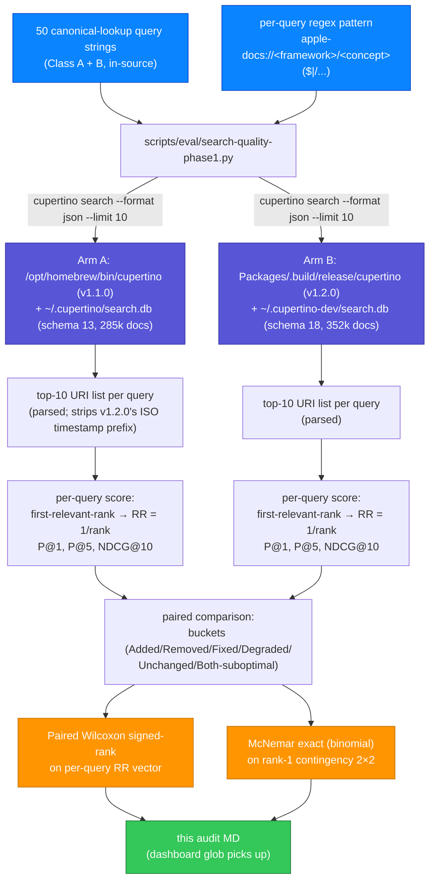

# Search-quality version diff: v1.1.0 → v1.2.0

**Date:** 2026-05-21
**Status:** Strong
**Headline:** +20 / 50 queries newly rank-1
**Arm A:** v1.1.0 (brew) — `/opt/homebrew/bin/cupertino` × `/Users/mmj/.cupertino/search.db` (v13, 285,735 docs)
**Arm B:** v1.2.0 (dev) — `/Volumes/Code/DeveloperExt/public/cupertino/Packages/.build/release/cupertino` × `/Users/mmj/.cupertino-dev/search.db` (v18, 352,712 docs)
**Methodology:** `docs/design/search-quality-eval.md` Phase 1 (Class A canonical lookup + Class B framework-root, paired comparison mode)
**Harness:** `scripts/eval/search-quality-phase1.py`
**Universal rule:** `../private/mihaela-agents/Rules/universal/search-quality-eval.md`
**Companion handbook:** `docs/database-handbook.md` §5

This is the Phase 1.8 version-to-version comparison KPI specified in issue #830, applied to the `v1.1.0` → `v1.2.0` jump. End-to-end measurement (binary + DB both swap between arms) so it captures the full user-felt delta, not a binary-held-constant or schema-held-constant slice.

---

## Aggregate

| Metric | v1.1.0 (brew) | v1.2.0 (dev) | Delta |
|---|---|---|---|
| N queries | 50 | 50 | — |
| **MRR** | **0.6900** | **0.9467** | **+0.2567** |
| P@1 | 0.5200 (26 / 50) | 0.9200 (46 / 50) | +0.4000 |
| P@5 | 0.2240 | 0.2760 | +0.0520 |
| NDCG@10 | 0.9892 | 1.4809 | +0.4917 |

**Headline:** 20 / 50 queries newly rank-1 in v1.2.0 (Added + Fixed); 0 regression.

---

## Paired statistical tests

**Paired Wilcoxon signed-rank on per-query RR (B vs A):**

- N_nonzero = 22
- W+ = 251.50, W− = 1.50
- Two-sided p = 0.000049
- One-sided p (v1.2.0 > v1.1.0) = 0.000025

**McNemar on rank-1 outcome:**

|  | v1.2.0 rank-1 | v1.2.0 not rank-1 |
|---|---|---|
| **v1.1.0 rank-1** | 26 (concordant +) | 0 (regression) |
| **v1.1.0 not rank-1** | 20 (improvement) | 4 (concordant −) |

- Discordant pairs: b = 0, c = 20
- McNemar exact (binomial), two-sided p = **0.000002**

---

## Buckets

| Bucket | Count | Definition | Queries |
|---|---|---|---|
| **Added** | **4** | Was outside top 10 in v1.1.0, now rank-1 in v1.2.0 | `Optional`, `Dictionary`, `Data`, `URL` |
| **Removed** | **0** | Was rank-1 in v1.1.0, no longer rank-1 in v1.2.0 | — |
| **Fixed** | **16** | Was found in v1.1.0 but below rank 1, now rank-1 in v1.2.0 | `Hashable`, `Equatable`, `Comparable`, `Sequence`, `AsyncSequence`, `Result`, `Array`, `Set`, `DateFormatter`, `Observable`, `Observation`, `State property wrapper`, `EnvironmentObject`, `ForEach`, `UIColor`, `NSWindow` |
| **Degraded** | **1** | First-relevant rank moved further from rank 1 | `CoreData (rank 2 → rank 3)` |
| Unchanged (both rank-1) | 26 | Same rank-1 outcome in both versions | majority of the corpus |
| Both still suboptimal | 2 | Neither version returned a relevant doc at rank 1 | `MapKit`, `SwiftUI View` |

---

## Method recap

Single-token canonical-lookup queries (Class A) + framework-root queries (Class B) from `scripts/eval/search-quality-phase1.py`'s `CANONICAL_QUERIES` corpus. For each query: `cupertino search --search-db <db> --format json --limit 10 "<query>"`, parse the URI list, check each against the per-query right-answer regex, record the first matching rank. Per-query reciprocal rank = 1 / first_rank (0 if no match in top 10). NDCG@10 uses gain=1 per match, IDCG=1 (multi-match sibling URIs can push NDCG > 1 as documented in `docs/design/search-quality-eval.md` §8.2; this is preserved here for comparability with the v1.0.2 audit).

---

## What this measurement does NOT capture

Same caveats as `search-quality-versiondiff-v1.0.2-to-v1.2.0.md`:

- **Criterion 2 (anti-hallucination).** Whether an AI agent given the v1.2.0 top-K actually produces correct Swift. Phase 1.7 (`docs/design/anti-hallucination-eval.md`).
- **Per-query class breakdown.** The seven Phase 1.x classes (deprecation, cross-source, fragment, acronym, prose, symbol-attribute, agent-end-to-end) each have their own audit. This version diff is restricted to **class A + class B**.
- **Coverage signals.** The v1.2.0 round shipped `apple_imports_json` (1/183 → 164/183) and `swift_tools_version` (0/183 → 182/183) coverage on packages.db, but the canonical-lookup corpus doesn't query packages. Those gains land in a separate packages-side audit that doesn't exist yet.

---

## Pipeline

