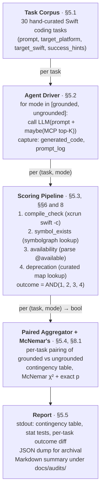

# Design: anti-hallucination agent-end-to-end evaluation (Phase 1.7)

| Field | Value |
|---|---|
| **Status** | draft |
| **Created** | 2026-05-20 |
| **Last revised** | 2026-05-20 |
| **Tracking issue** | none yet |
| **Companion docs** | `docs/design/search-quality-eval.md` (this design is its §14.4); `README.md` ("Why build this") (the purpose this measures); `docs/architecture/database.md` (the substrate); `docs/database-handbook.md` §5 (index) |

---

## TL;DR

Cupertino's stated purpose is anti-hallucination grounding for AI coding agents writing Swift / Apple-platform code. The Phase 1.x baselines (`docs/audits/search-quality-*-baseline-v1.2.0.md`) measure Criterion 1 (good search) — necessary but not sufficient. This design specifies Phase 1.7: the actual release-blocker test that measures Criterion 2 directly. The shape: ~30 hand-curated Swift coding tasks, each run with an LLM agent in two modes (grounded on cupertino's MCP top-K vs ungrounded baseline). Each generated code response is scored on four mechanical criteria: (1) it compiles, (2) every called symbol exists in the active SDK, (3) it respects target-platform availability, (4) it doesn't call deprecated APIs when a current alternative exists. Paired McNemar's test on the binary "compiles-and-correct" outcome. A regression demands attention before any ranking-change ships; a fresh implementation of this is the highest-value work item after the Phase 1.x audit set. The harness is not yet built; this doc specifies it.

---

## 1. Context

### 1.1 Why this measurement exists

Cupertino's user-facing pitch (`README.md` §"Why Build This?") is:

> No more hallucinations: AI agents get accurate, up-to-date Apple API documentation.

And from the current README's "Why build this" section:

> AI coding agents (Claude, Copilot, Cursor, etc.) need accurate, current Apple API references to avoid generating code that calls nonexistent symbols, uses deprecated APIs, or violates platform availability constraints.

The four failure modes named there are the four criteria this design scores against. Until we measure them end-to-end, the claim "cupertino reduces hallucinations" is unfounded. The Phase 1.x baselines from 2026-05-20 give us evidence about *findability* (Criterion 1): MRR 0.9467 on canonical lookups, 100% Swift-over-NS-class promotion on the deprecation axis, etc. None of these directly measures whether an agent, given those results, actually produces correct Swift.

### 1.2 Why Phase 1 baselines are not enough

High MRR on the right query is necessary but not sufficient. An agent can:

- Receive the right doc at rank 1, then misread it and call a non-existent overload
- Receive the right doc but ignore the availability annotation
- Receive the right doc and produce correct code (the win case)
- Receive a wrong-but-plausible doc and confidently produce wrong code (the bad case)
- Receive no useful results and fall back to its training-data prior (the variable case; sometimes correct, sometimes hallucinatory)

Cupertino reduces failure-mode prevalence only if grounded-mode wins are systematically higher than ungrounded-mode wins. That is the McNemar setup.

### 1.3 Why now

Six Phase 1.x baselines landed on develop on 2026-05-20. Two of them surface mechanism weaknesses (acronym 18%, symbol-attribute 25%). Before any of those mechanisms gets fixed, we want a Criterion-2 baseline so a change can be evaluated as "fixed the IR mechanism AND improved (or didn't hurt) actual agent-grounding outcomes." Without this baseline, IR-mechanism fixes are flying blind on what matters.

---

## 2. Goals

### P0

- **G1**: A reproducible harness that runs ~30 Swift coding tasks against one LLM (configurable) in two modes (grounded / ungrounded) and produces per-task binary outcomes (compiles-and-correct vs not). Verified by: harness exits cleanly, JSON dump exists, paired McNemar's reported.
- **G2**: Each generated code response scored mechanically by: (a) compiles via `xcrun swift`, (b) every called symbol exists in the SDK (symbolgraph lookup), (c) respects `@available` of target platform, (d) doesn't call deprecated APIs when a current alternative is documented. Verified by: scoring report shows per-criterion pass/fail per task.
- **G3**: Statistical comparison via paired McNemar's test on the binary outcome. Verified by: output includes χ² statistic and exact-test p-value.
- **G4**: A task corpus curated by hand, ~30 tasks, covering breadth: SwiftUI, Foundation, Combine→async, concurrency, error handling, sample-code style snippets. Verified by: corpus has ≥6 tasks per major Apple framework family.

### P1

- **G5**: Per-task qualitative summary: what the agent produced, what cupertino's top-K returned, where it diverged. Useful for diagnosing why a regression happened, not just that it happened.
- **G6**: Reusable against multiple LLMs (Claude, GPT, Gemini) by switching the agent driver. The methodology should be model-agnostic.
- **G7**: Cost-bounded. Roughly: 30 tasks × 2 modes × ~$0.02 per task = $1.20 per run on Claude-class models. Bounded compute (no fine-tuning, no multi-hop).

### P2

- **G8**: Per-criterion failure breakdown (compile-fail vs symbol-doesn't-exist vs availability-violation vs deprecation) to attribute regressions to specific failure modes.
- **G9**: Per-task "interesting" annotation: tasks where grounded and ungrounded modes disagree are the most informative; surface them prominently.

---

## 3. Non-goals

- **NG1**: General-purpose LLM evaluation. *We are not building SWE-bench-style code-eval infrastructure. The cupertino-specific task corpus is Apple-platform Swift, small enough to hand-maintain. If the project ever needs broader coverage, we adopt an existing benchmark; we do not extend this harness toward general-purpose code eval.*

- **NG2**: Multi-turn agent simulation. *The harness issues one query per task. Real agent sessions are multi-turn (the agent retries with refined queries when the first batch is unhelpful); the harness does not model that. The single-turn limit is a conservative lower bound: real-world cupertino-with-multi-turn-agent should perform at least as well.*

- **NG3**: Evaluation of any LLM other than what the driver supports. *The harness specifies the LLM via a driver interface; running it against a new model requires writing a driver. We do not maintain a zoo of drivers.*

- **NG4**: Production CI gating. *Same caveat as the Phase 1.x baselines: the harness is a research tool. Wiring it into CI requires deciding what regression delta blocks a merge, a policy decision out of scope here.*

- **NG5**: Continuous re-running. *Cost ~$1.20 per run, plus ~10-15 min of LLM-API and toolchain wall time. Run on every major ranking-affecting change (BM25F weight tweak, new column, tokenizer change) and quarterly otherwise; not on every commit.*

- **NG6**: A composite "anti-hallucination score" combining all four scoring criteria. *Each criterion has different failure costs; combining them into one number hides where the system is fragile. Per-criterion reporting is mandatory.*

- **NG7**: Using cupertino itself to evaluate cupertino. *The scoring step uses `xcrun swift` for compile, `swift symbolgraph-extract` for symbol existence, and `@available` parser for availability. None of these is cupertino. The harness measures cupertino from the outside.*

---

## 4. Requirements

### 4.1 Functional

| ID | Requirement | Verified by |
|---|---|---|
| F1 | Task corpus of ≥30 Swift coding tasks, each with (prompt, target_platform, target_swift_toolchain). | Source: count of `Task(...)` entries ≥ 30 |
| F2 | Agent driver protocol with two implementations: grounded (cupertino MCP available) and ungrounded (no MCP). | Same prompt produces different LLM context; driver records both. |
| F3 | Each generated code response scored on 4 criteria (compile, symbol-exists, availability, no-deprecated). | Scoring report has 4 pass/fail flags per task per mode. |
| F4 | Per-task binary "compiles-and-correct" outcome (all 4 criteria pass). | Outcome appears in report. |
| F5 | Paired McNemar's test on per-task binary outcome between grounded and ungrounded modes. | Output includes McNemar's χ² and exact-test p-value. |
| F6 | JSON dump of full per-task records for post-hoc inspection. | File exists at `/tmp/cupertino-anti-hallucination-eval-<TS>.json` after run. |

### 4.2 Non-functional

| ID | Requirement | Target | Current state |
|---|---|---|---|
| N1 | Wall time per full run (30 tasks × 2 modes) | < 30 min | not measured (harness not built) |
| N2 | Cost per run | < $5 on Claude-class models | not measured |
| N3 | Reproducibility | Same model + same prompt + same seed (where supported) produces same outcome | not measured |
| N4 | Cupertino DB / binary unchanged after run | Read-only against the DB; no writes | trivial; only `cupertino search` invocations |
| N5 | Toolchain version pinning | The Swift toolchain used for compile-check matches a declared version | pin via `xcrun --toolchain swift-<X>.<Y>` |

---

## 5. Design Overview



Five components, all stateless beyond the task corpus and the LLM cache (if any). The agent driver and the scoring pipeline are the two non-trivial components; the rest is glue.

---

## 6. Detailed Design

### 6.1 Task corpus

*Goal: define what "a representative Swift coding task" looks like for cupertino's user.*

A `Task` carries:

```python
@dataclass(frozen=True)
class Task:
    id: str                           # short stable identifier
    prompt: str                       # the user's natural-language request
    target_platform: str              # "ios18.0" | "macos15.0" | etc.
    target_swift: str                 # "6.3" | "6.2" | etc.
    success_hints: list[str]          # symbols / patterns the correct code should use
    failure_hints: list[str]          # symbols / patterns indicating hallucination
```

Tasks are curated to cover breadth:

- **SwiftUI** (≥6 tasks): "make a SwiftUI view that observes a model", "implement a NavigationStack with programmatic navigation", "add an animation modifier", etc.
- **Foundation** (≥6 tasks): "decode JSON with custom date format", "fetch a URL with URLSession async/await", "format a Date for the user's locale"
- **Concurrency** (≥4 tasks): "convert a Combine pipeline to async/await", "make this type Sendable", "isolate this property to MainActor"
- **Observation** (≥3 tasks): "make this model @Observable so SwiftUI re-renders"
- **Error handling** (≥3 tasks): "handle network errors with typed throws"
- **WidgetKit / AppIntents / SwiftData** (≥4 tasks): newer-API surfaces where hallucination risk is highest because the API may not be in the LLM's training data

`success_hints` and `failure_hints` are not used by the scoring pipeline (which uses the four mechanical criteria) but are surfaced in the per-task report so a human reviewer can quickly understand what "correct" looks like for that task.

### 6.2 Agent driver

*Goal: run one LLM in two modes — with and without cupertino MCP — over the same prompt.*

Two implementations of a `Driver` protocol:

- **GroundedDriver**: spawns `cupertino serve` as an MCP subprocess, configures the LLM client to use it. The LLM is free to issue search / read tool calls. Driver logs every tool call the LLM makes.
- **UngroundedDriver**: same LLM client, no MCP. The LLM relies on its training-data prior.

Both drivers receive the same `prompt`, `target_platform`, `target_swift` and return a `GeneratedResponse(code: str, tool_calls: list, prompt_log: list)`.

The grounded driver records every cupertino tool call the LLM issued. This is independently interesting: it tells us how the agent uses cupertino in practice, which we can compare against assumed query shapes in the Phase 1.x baselines.

### 6.3 Scoring pipeline

*Goal: turn a generated Swift code snippet into a binary "correct" outcome via four mechanical checks.*

#### 6.3.1 Compile check

Wrap the generated snippet in a minimal Swift package or single-file scaffold, run `xcrun --toolchain swift-<target_swift> swiftc -parse <file.swift>`. Pass = no diagnostics. Fail = any diagnostic, captured verbatim.

#### 6.3.2 Symbol-exists check

For every symbol referenced in the generated code (extracted by SwiftSyntax — cupertino's own ASTIndexer is reusable here), check whether it exists in the target SDK. Use `swift symbolgraph-extract` on the active toolchain (the same source the cupertino-symbolgraphs sibling repo uses) to build a per-target symbol set. Pass = every referenced symbol exists. Fail = at least one symbol doesn't, recorded with file + line.

#### 6.3.3 Availability check

Parse the generated code for symbol references. For each, look up the symbol's `@available` annotation in the symbolgraph. If the symbol's min-version exceeds the task's `target_platform`, that's a violation. Pass = no violations. Fail = at least one symbol used outside its availability window.

#### 6.3.4 Deprecation check

A curated `deprecation_map.json` maps deprecated APIs to current alternatives: `{"NSURLConnection": "URLSession", "NSURLConnectionDelegate": "URLSessionDelegate", ...}`. If the generated code calls any key from the map, fail. The map is the only piece of hand-curated state in the scoring pipeline; it must be reviewed when a new major Apple release deprecates new APIs.

#### 6.3.5 Outcome

`outcome = compile AND symbol_exists AND availability AND no_deprecated`. Binary per (task, mode).

### 6.4 Aggregator

*Goal: produce a 2×2 contingency table per task across the two modes.*

For each task t: `(outcome_grounded(t), outcome_ungrounded(t))`. The 2×2 contingency table over the corpus:

|  | grounded pass | grounded fail |
|---|---|---|
| ungrounded pass | a | b |
| ungrounded fail | c | d |

`a` is "both modes work" (baseline shared wins). `d` is "neither works" (out of cupertino's reach). `b` is "ungrounded worked, grounded failed" — the worry case. `c` is "grounded worked, ungrounded failed" — the win case.

McNemar's test (§8.1) operates on the discordant cells (b, c). The null hypothesis: `b == c` (grounding has no effect). Alternative: `c > b` (grounding helps).

### 6.5 Reporter

*Goal: produce both a stdout summary and a Markdown audit doc.*

Stdout:
- Aggregate contingency table
- McNemar's statistic and p-value
- Per-criterion failure breakdown (where did the failures land)
- Per-task outcome diff: list of tasks where grounded and ungrounded disagree, with one-line reasons

Markdown:
- Lands at `docs/audits/anti-hallucination-eval-<TS>.md`
- Same content as stdout, plus the prompt + generated-code snippets for the most interesting (discordant) tasks
- Linked from `docs/database-handbook.md` §5 by the same rot-prevention rule (handbook §7)

---

## 7. Data Model

### 7.1 Task corpus

In-source Python list of `Task` dataclass instances, at `scripts/eval/anti-hallucination/tasks.py`. Same rationale as Phase 1.x: 30 entries with regex / hint fields is more readable as Python source than as TSV.

### 7.2 Results JSON

```json
{
  "harness_version": "1",
  "model": "claude-sonnet-4-6",
  "n_tasks": 30,
  "toolchain": "swift-6.3",
  "per_task": [
    {
      "id": "swiftui-observable-list",
      "prompt": "...",
      "target_platform": "ios18.0",
      "modes": {
        "grounded": {
          "code": "...",
          "tool_calls": [...],
          "compile": true,
          "symbol_exists": true,
          "availability": true,
          "no_deprecated": true,
          "outcome": true
        },
        "ungrounded": { "...same shape..." }
      }
    },
    ...
  ],
  "aggregate": {
    "contingency": [[a, b], [c, d]],
    "mcnemar_chi2": 4.0,
    "mcnemar_p_exact": 0.0625
  }
}
```

### 7.3 Deprecation map

```json
{
  "NSURLConnection": {
    "alternative": "URLSession",
    "deprecated_since": "iOS 9.0 / macOS 10.11",
    "reason": "non-async, no Swift-first API",
    "first_added_to_map": "2026-05-20"
  },
  ...
}
```

Curated manually. Initial entries: a few dozen well-known Foundation / UIKit / older-Apple-API deprecations. Grows as new Apple deprecations land.

---

## 8. Algorithms / Protocols

### 8.1 Paired McNemar's test

The standard non-parametric test for paired binary outcomes (Dunn 1985, McNemar 1947). Given the 2×2 contingency table from §6.4:

```
χ² = (|b - c| - 1)² / (b + c)              [continuity-corrected]
or
exact p = 2 × min(P(X ≤ min(b,c)), P(X ≥ min(b,c)))   for X ~ Binom(b+c, 0.5)
```

For small N (b + c < 25), use the exact binomial form; for large N the χ² approximation is fine.

Reported one-sided: `grounded helps` corresponds to `c > b`.

Implementation: `scipy.stats.mcnemar` (table form) or `scipy.stats.binomtest` directly on the discordant pair.

### 8.2 Symbol existence via symbolgraph

The `swift symbolgraph-extract` tool produces per-module JSON describing every public API surface. The harness pre-builds (once per target_swift / target_platform combination) a flat lookup table:

```python
SymbolGraphIndex = dict[str, SymbolMeta]   # "Foundation.URLSession" -> SymbolMeta
```

where `SymbolMeta` carries the module, kind, `@available` constraints, and deprecation status. Lookup is O(1).

Generated code → AST → list of symbol references via SwiftSyntax. For each, look up in the index. Miss = fail.

### 8.3 Reuse from cupertino

The harness uses three cupertino-adjacent pieces without modifying them:

- `ASTIndexer` for symbol-reference extraction from generated code (same package cupertino uses to extract symbols from doc snippets)
- `cupertino-symbolgraphs` sibling repo as the symbolgraph data source
- `cupertino serve` as the MCP grounding backend in the grounded mode

None of these is modified. The harness is a pure consumer.

---

## 10. Reliability and failure modes

| Failure mode | Detection | Mitigation |
|---|---|---|
| LLM API timeout / error | API error response | retry with exponential backoff up to 3 attempts; if all fail, record task as outcome=fail with reason |
| LLM produces non-Swift output (markdown chatter, no code block) | Code extractor returns empty | treat as compile=fail with reason "no code produced" |
| Generated code parses but doesn't compile due to missing imports | Compile check captures diagnostic | record as compile=fail with the diagnostic verbatim |
| Symbolgraph corpus for the target Swift version not available | Pre-flight check at script start | fail-fast with instructions: "run cupertino-symbolgraphs-gen for target_swift, see its README" |
| Toolchain not installed (`xcrun --toolchain swift-X.Y` fails) | Pre-flight check | same: fail-fast with the install command |
| Deprecation map out of date (new Apple deprecation not in map) | None automatic | manual review after every major macOS / iOS release |
| MCP subprocess crashes mid-run | Driver detects EOF | record task as outcome=fail in grounded mode, continue with ungrounded |
| Cost overrun (LLM API price spike) | Pre-flight budget check (`if N_tasks × cost_per_task > $5: warn`) | abort or confirm |

### 10.1 What we explicitly do NOT recover

- **Cupertino's MCP server failing to start.** If `cupertino serve` won't start, the grounded mode is meaningless; abort the run rather than report `all grounded tasks failed`.
- **Disagreement between the deprecation map and the symbolgraph's deprecation status.** When they conflict, the symbolgraph wins (it's the authoritative SDK), but the discrepancy gets logged for manual map update.
- **Out-of-corpus tasks.** If a task references an Apple framework not in the symbolgraph corpus (a very-recent addition, or third-party), the symbol_exists check fails for that task; we accept this as a corpus-staleness signal, not a bug.

---

## 11. Security and privacy

The LLM is given the prompt (which the cupertino maintainer controls), no user data. The grounded mode exposes cupertino's search and read tools to the LLM, which can read public Apple documentation; no private data crosses any boundary. The harness writes generated code and a JSON report locally. No telemetry, no network call beyond the LLM API and cupertino's MCP subprocess.

Cost is the only real exposure: a buggy harness or runaway loop could rack up LLM API charges. The budget pre-flight check mitigates.

---

## 12. Observability

- stdout: per-task progress, aggregate table, McNemar, per-task diff
- JSON dump at `/tmp/cupertino-anti-hallucination-eval-<TS>.json`
- Markdown summary at `docs/audits/anti-hallucination-eval-<TS>.md`
- LLM tool-call log per grounded task (separate file, since it can be large) at `/tmp/cupertino-anti-hallucination-eval-<TS>-toolcalls.jsonl`

No log file rotation; the harness is run on demand, not continuously.

---

## 13. Open questions

| Question | Resolution path |
|---|---|
| Which LLM(s) to use as the primary measurement? | Probably Claude (since cupertino's primary consumer is Claude via MCP). Other models added as drivers later if needed. |
| How to handle nondeterminism (LLM temperature, sampling)? | Pin temperature=0 where supported; record seed if the model accepts one. Accept that some variance is unavoidable. |
| What if the deprecation map disagrees with current Apple docs? | The symbolgraph wins. Log the discrepancy for manual map update. |
| Should the prompt include an explicit `respect @available(ios 18.0+)` instruction? | Probably yes — the goal is to measure grounding effect, not prompt-engineering. Document the prompt template. |
| How often do tasks need to be refreshed? | Quarterly review. Add tasks when major new APIs ship (e.g., new Swift compiler release, new WWDC framework). |
| Should the harness measure latency in addition to correctness? | Probably no — latency is measured by the Phase 1.x harnesses; this one focuses on outcome. Out of scope. |
| How is failure-mode attribution scored when multiple criteria fail? | Report all failing criteria per task; don't pick one. The per-criterion breakdown surfaces which criterion is the dominant failure mode. |

---

## 14. Implementation plan

1. **Land this design doc** on develop so the methodology is durable. *(This doc.)*
2. **Build the task corpus** (~30 tasks). 1-2 hours; pure curation, no code.
3. **Build the symbol-graph index** for the current Swift toolchain. Reuse `cupertino-symbolgraphs-gen`; one-time setup.
4. **Build the deprecation map** initial entries (~20-30 well-known deprecations). 1 hour.
5. **Build the scoring pipeline** (compile, symbol-exists, availability, deprecation). Each is small; total ~1 day.
6. **Build the agent driver** (LLM API client + MCP integration). The grounded mode is the harder part because `cupertino serve` needs to be embedded; ~1 day.
7. **Wire the aggregator + reporter.** ~half day.
8. **First formal run** on the v1.2.0 candidate DB. Publish results to `docs/audits/anti-hallucination-eval-baseline-v1.2.0.md`.

Per the `feedback_code_changes_as_ideas_for_future` memory rule, steps 2-8 are explicit follow-up work and are not landed by this design.

Estimated total: 1-2 weeks of focused work for the first end-to-end run.

---

## 15. References

1. **`docs/design/search-quality-eval.md`** §14.4 — this design is the implementation of that section.
2. **`README.md`** "Why build this" — the purpose this measures.
3. **`docs/architecture/database.md`** — the substrate under test.
4. **`docs/audits/search-quality-*-baseline-v1.2.0.md`** — the six Phase 1.x baselines this complements with Criterion 2.
5. McNemar, Q. (1947). Note on the sampling error of the difference between correlated proportions or percentages. *Psychometrika* 12(2): 153-157.
6. Dunn, O. J. (1985). Estimation of the medians for dependent variables. *Annals of Mathematical Statistics*. (Modern context for McNemar's.)
7. SWE-bench (Jimenez et al., 2024) — general-purpose code-eval benchmark; explicit NG1 not to replicate, but a reference for the "compile + functional-correctness" scoring approach.
