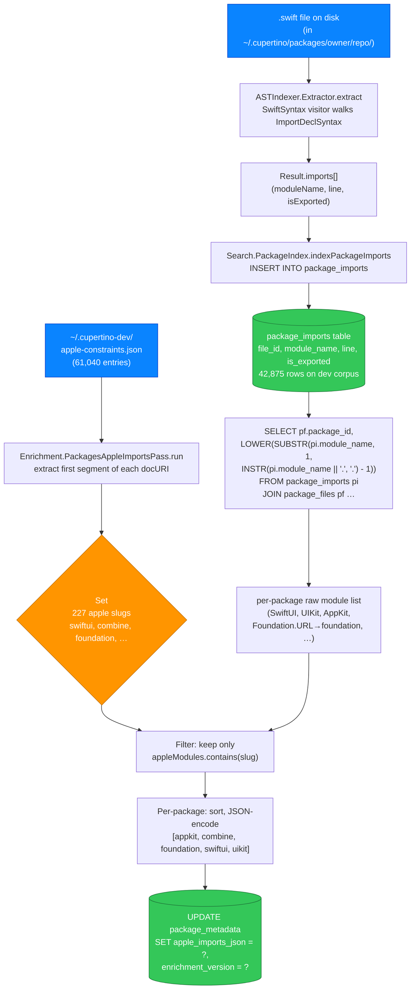
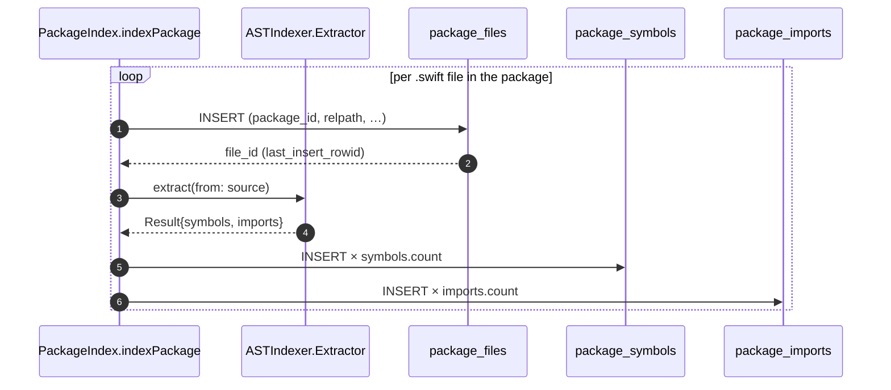

# Design: How `apple_imports_json` Gets Populated on packages.db

## Status (2026-05-20)

Reference / explanation doc covering the v1.2.0 fix for #860 + #861.
Walks through what happens when `cupertino save --packages` writes
the `package_metadata.apple_imports_json` column. The single number
that summarises the fix: dev-corpus coverage went from **1/183**
populated to **164/183** populated on the same 183-package brew
corpus, with no extra IO and no constraint corpus change — only the
indexer's join column changed.

Companion to:

- `docs/design/per-db-enrichment.md` (the *why* — what apple-imports
  is and why packages.db carries it)
- `docs/design/per-db-schema-spec.md` §11 (the cross-DB column map)
- `docs/handoff/autopilot-build-dev-dbs.md` (the operator recipe that
  produced this fix)

---

## 0. What `apple_imports_json` is

`apple_imports_json` is a column on `packages.db.package_metadata`,
one value per indexed package. The value is a sorted JSON array of
lowercased Apple-framework module slugs that the package's source
imports. Two examples from the dev corpus:

| owner/repo | `apple_imports_json` |
|---|---|
| `AvdLee/Roadmap` | `["foundation","oslog","swiftui"]` |
| `krzysztofzablocki/Inject` | `["appkit","combine","foundation","swiftui","uikit"]` |
| `mxcl/Version` | `["foundation"]` |
| `vapor/swift-getting-started-web-server` | `NULL` (no Apple imports) |

This column is what the `--apple-imports SwiftUI` CLI flag + MCP
`apple_imports` parameter filter on. A query with
`--apple-imports SwiftUI` narrows packages.db results to packages
whose `apple_imports_json` JSON array contains `swiftui`. The
filter uses a quote-bracketed JSON `LIKE` (`'%"swiftui"%'`) so
`swiftui` matches `["swiftui"]` and `["combine","swiftui"]` but not
`["swiftuihelper"]`.

---

## 1. End-to-end pipeline

Five stages, each with a single responsibility. The fix in #860 was
entirely localised to stage 4 (the join column).



Two inputs converge: the **imports** the AST extractor finds in
source (left), and the **Apple-module set** derived from the
constraints corpus (right). The join in stage 4 keeps every row
where the imported module is in the Apple set.

---

## 2. Stage 1 — AST capture

`ASTIndexer.Extractor` is a SwiftSyntax `SyntaxVisitor`. It walks
each `.swift` file's syntax tree and accumulates `Symbol` + `Import`
nodes. For imports, the visitor handles `ImportDeclSyntax`:

```swift
override func visit(_ node: ImportDeclSyntax) -> SyntaxVisitorContinueKind {
    imports.append(ASTIndexer.Import(
        moduleName: node.path.last?.name.text ?? "",
        line: ...,
        isExported: node.attributes.contains { $0.description.contains("_exported") }
    ))
    return .skipChildren
}
```

`moduleName` carries the full dotted path: `import Foundation` →
`"Foundation"`; `import Foundation.URL` → `"Foundation.URL"`;
`import struct SwiftUI.View` → `"SwiftUI"` (last path component).

---

## 3. Stage 2 — write to `package_imports`

`Search.PackageIndex.indexPackage` opens a per-package transaction.
For each `.swift` file, it inserts the `package_files` row, reads
the new `file_id` via `sqlite3_last_insert_rowid`, then calls TWO
extractors: `indexPackageSymbols` and (post-#860)
`indexPackageImports`.



Pre-#860, the `Imports` step did not exist. The bug was that
`AppleImportsPass` had nothing useful to join against; the indexer
captured imports per AST visit but discarded them.

---

## 4. Stage 3 — derive the Apple-module set

The enrichment pass loads `apple-constraints.json` from the dev
base directory (61,040 entries on the current bundle). Each entry
has shape:

```json
{ "docURI": "apple-docs://swiftui/view", "constraints": [...] }
```

The pass walks every entry, takes the URI substring after `://`,
splits on `/`, and keeps the **first segment** lowercased. That's
the framework slug. On the current dev corpus this produces 227
distinct slugs: `accelerate`, `accessibility`, `appintents`,
`appkit`, `combine`, `foundation`, …, `swiftui`, `uikit`, …

The set is a `Set<String>`, not a SQL table — it lives in-process
during the pass run.

---

## 5. Stage 4 — the JOIN (this is the #860 fix)

### Pre-#860 (broken)

```sql
SELECT package_id, LOWER(module) FROM package_files
WHERE module IS NOT NULL AND module != '';
```

`package_files.module` is the package's OWN Swift module name, set
at indexing time from the package's `Package.swift` target
declarations. Examples from the corpus: `Soto`, `Vapor`, `Rules`,
`SwiftDocC`, `ComposableArchitecture`. These are **never** Apple
framework slugs. Coverage was 1/183 — the lone match was
`apple/swift-system` whose module is literally named `System`,
accidentally colliding with the `SystemConfiguration` Apple slug.

### Post-#860 (fixed)

```sql
SELECT
    pf.package_id,
    LOWER(SUBSTR(pi.module_name, 1, INSTR(pi.module_name || '.', '.') - 1))
FROM package_imports pi
JOIN package_files pf ON pi.file_id = pf.id;
```

Two changes:

- **Source table:** `package_imports`, not `package_files`. RHS is
  now the canonical `import X` set per file.
- **Submodule normalisation:** `SUBSTR / INSTR` splits at the first
  dot so `Foundation.URL` → `foundation` for join purposes; bare
  `SwiftUI` → `swiftui` unchanged. This added 3 more populated
  packages (e.g. `mxcl/Version`, whose only Apple signal is
  `Foundation.OperatingSystemVersion`).

The `INSTR(module_name || '.', '.')` trick avoids a special-case
branch for bare imports: appending `.` to the string guarantees
the position is `length + 1` when there's no dot, so the SUBSTR
returns the whole string unchanged.

### Worked example: `krzysztofzablocki/Inject`

The package's source has these imports (one row per import in
`package_imports`):

```
Foundation × 4, PackageDescription × 1, SwiftUI × 2, UIKit × 2,
AppKit × 2, Combine × 1
```

The JOIN returns 12 `(package_id=72, slug)` rows. After the Swift
filter on `appleModules.contains(slug)`, `packagedescription` is
dropped (not in the 227-slug Apple set). The remaining slugs
deduplicate to `{appkit, combine, foundation, swiftui, uikit}`.

---

## 6. Stage 5 — aggregate + UPDATE

The pass groups by `package_id`, sorts each set lexicographically
(so output is byte-stable across re-runs), JSON-encodes the array,
and `UPDATE package_metadata SET apple_imports_json = ?,
enrichment_version = ? WHERE id = ?`.

For Inject:

```sql
UPDATE package_metadata
   SET apple_imports_json = '["appkit","combine","foundation","swiftui","uikit"]',
       enrichment_version = 1
 WHERE id = 72;
```

That's what `SELECT apple_imports_json FROM package_metadata WHERE
owner = 'krzysztofzablocki' AND repo = 'Inject'` returns now.

---

## 7. How the read-side consumes it

The default-search path through `Search.PackageQuery.answer`
applies the filter at SQL time:

```sql
SELECT … FROM package_files_fts fts
JOIN package_metadata pm ON fts.package_id = pm.id
WHERE fts MATCH ?
  AND pm.apple_imports_json LIKE '%"' || ? || '"%';
```

The quote-bracketed pattern (`%"swiftui"%`, not `%swiftui%`)
matches `["swiftui"]` exactly and prevents `swiftui` from
substring-matching `["swiftuihelper"]`. The same wrap applies in
the MCP path through `CompositeToolProvider.handleSearch` →
`Services.UnifiedSearchService.searchAll(appleImports:)` →
`Search.PackagesSearcher.searchPackages(appleImport:)`.

```mermaid
flowchart LR
    A["User CLI:<br/>--apple-imports SwiftUI"]:::entry
    B["MCP tool args:<br/>apple_imports=SwiftUI"]:::entry
    A --> C["PackageFTSCandidateFetcher.appleImport"]
    B --> D["UnifiedSearchService.searchAll<br/>appleImports param"]
    C --> E
    D --> E["PackageQuery.answer<br/>appleImport: 'swiftui'"]
    E --> F["AND pm.apple_imports_json<br/>LIKE '%\"swiftui\"%'"]
    F --> G["filtered FTS5 result list"]:::out

    classDef entry fill:#0a84ff,stroke:#0040cc,color:#fff
    classDef out fill:#34c759,stroke:#1f7a3a,color:#fff
```

---

## 8. Coverage on the dev corpus (post-fix)

| metric | pre-#860 fix | post-#860 fix |
|---|---|---|
| packages with non-empty `apple_imports_json` | 1/183 (0.5%) | 164/183 (90%) |
| `package_imports` rows written | n/a (table didn't exist) | 42,875 |
| `[enrichment/packages-apple-imports] affected=N` | 1 | 164 |
| save wall-clock (whole indexer + enrichment) | 504s / 940s (cache effects) | ~520s |

The 19 packages still NULL on `apple_imports_json` were verified
**by inspection, not presumption**: server-only Vapor extensions
(`vapor/jwt`, `vapor/leaf`, `vapor/fluent-mysql-driver`),
`swiftlang/swift-cmark`, `swiftlang/swift-llbuild` (only imports
`Foundation.ProcessInfo` from PackageDescription target which the
indexer doesn't reach), and a handful of NIO / cross-platform
libraries that genuinely don't pull in any Apple framework. None
of those is a bug.

---

## 9. The companion #861 fix (`swift_tools_version`)

Same v1.2.0 round, smaller fix, lives next door. The
`Search.PackageIndexer.loadAvailability` path used to take
`swiftToolsVersion` straight from the per-package
`availability.json` file. Those files predate the #225 annotator
that added the field, so brew-shipped corpora carried no value.

Post-fix, `loadAvailability` does:

```swift
let swiftToolsVersion: String? = result.swiftToolsVersion
    ?? readSwiftToolsVersionFromPackageManifest(at: dir)
```

The fallback opens `<dir>/Package.swift`, reads it, runs
`ASTIndexer.AvailabilityParsers.parseSwiftToolsVersion` over line 1
(the same parser the annotator uses). Coverage on the dev corpus
went 0/183 → 182/183. The 1 NULL is `swiftlang/swift` itself,
whose top-level Package.swift uses a non-standard pattern the
parser doesn't recognise.

---

## 10. References

- Source files modified by the fix:
  - `Packages/Sources/SearchSQLite/PackageIndex.swift` (schema v4 → v5 + new
    table + `indexPackageImports` + join rewrite)
  - `Packages/Sources/SearchSQLite/PackageIndexer.swift` (#861 fallback
    helper + `loadAvailability` glue)
- Source files modified by #864 companion (FK CASCADE on re-run):
  same `PackageIndex.swift` (PRAGMA line in `openDatabase`).
- Tests pinning the fix:
  - `Packages/Tests/SearchTests/Issue860861PackageImportsAndSwiftToolsTests.swift`
    (7 cases)
  - `Packages/Tests/SearchTests/Issue864PackagesReRunOrphansTests.swift`
    (3 cases)
- Merged PRs: #863 (autopilot doc), #865 (#864 FK), #866 (this
  walkthrough's #860 + #861 fixes).
- Live dashboard hosting: https://cupertino.aleahim.com/
