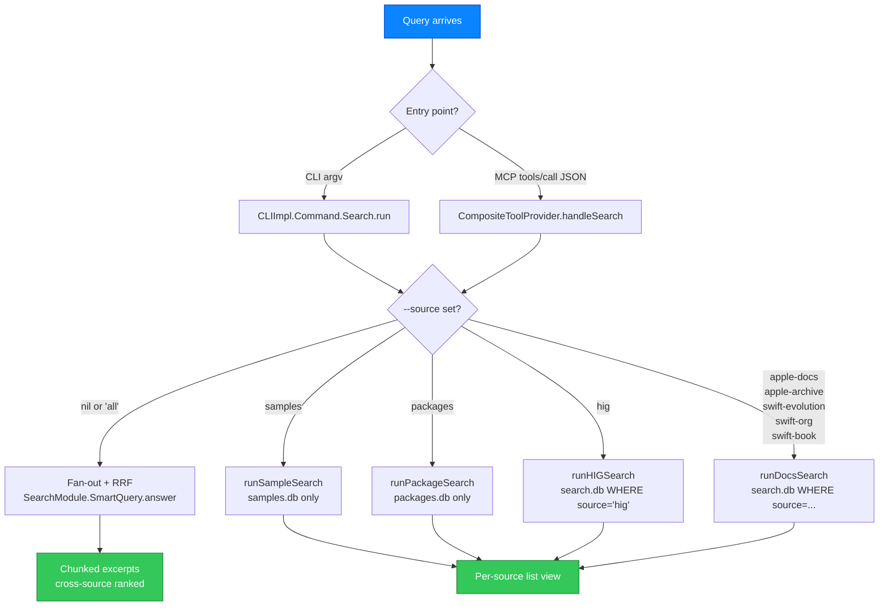
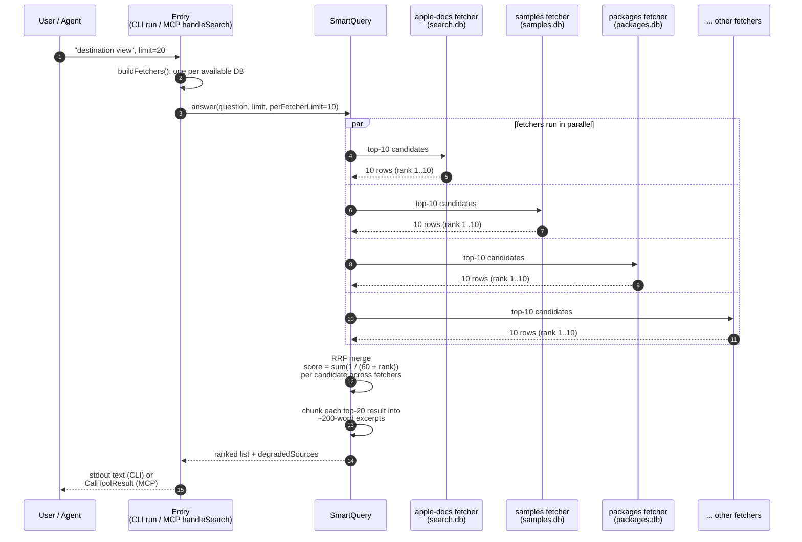

# Design: How cupertino Answers a Search Query

## Status (2026-05-20)

Reference / explanation doc. Not gated on any specific issue.
Written from first principles — every load-bearing term is defined
before it is used. Companion to
`docs/design/837-pre-index-test-plan.md` (which covers the
write-side) by describing the read-side: when a query arrives at
cupertino, exactly what happens, and how the `--source` parameter
changes that.

---

## 0. What a "query" is, where it comes from

A query is a free-form string the user wants cupertino to answer.
Concrete examples:

- `"how do I make a SwiftUI view observable"`
- `"@Observable"`
- `"actor reentrancy"`
- `"Core Animation"`

Two entry points produce a query:

| Entry point | Who types it | Where it enters the codebase |
|---|---|---|
| **CLI** | A human at the terminal: `cupertino search "..."` | `CLIImpl.Command.Search.run()` in `Packages/Sources/CLI/Commands/CLIImpl.Command.Search.swift` |
| **MCP** | An AI agent (Claude, Cursor, etc.) sending a JSON-RPC `tools/call` over stdio to the cupertino MCP server | `CompositeToolProvider.handleSearch(args:)` in `Packages/Sources/SearchToolProvider/CompositeToolProvider.swift` |

Both entry points hand the query off to the SAME underlying Swift
code beneath the surface dispatch. The only difference between CLI
and MCP at the entry layer is how the query string + parameters
arrive (argv vs. JSON object) and how the result leaves (stdout
text/JSON vs. MCP tool-call result). The ranking, SQL, and DB
choice are identical.

---

## 1. The eight sources cupertino can answer from

cupertino's bundle is three SQLite files (search.db, samples.db,
packages.db). Inside `search.db`, rows are tagged with a `source`
column so a single DB can hold logically distinct corpora. The
eight enumerated sources are:

| Source identifier | What it contains | Which DB physically holds it |
|---|---|---|
| `apple-docs` | Modern Apple framework reference pages (SwiftUI, UIKit, Foundation, …) | `search.db`, `source = 'apple-docs'` |
| `apple-archive` | Legacy guides (Core Animation, Quartz 2D, KVO/KVC) | `search.db`, `source = 'apple-archive'` |
| `swift-evolution` | Swift Evolution proposals (SE-0001, …) | `search.db`, `source = 'swift-evolution'` |
| `swift-org` | swift.org documentation pages | `search.db`, `source = 'swift-org'` |
| `swift-book` | The Swift Programming Language book chapters | `search.db`, `source = 'swift-book'` |
| `hig` | Human Interface Guidelines | `search.db`, `source = 'hig'` |
| `samples` | Apple sample-code projects + their Swift files + extracted symbols | `samples.db` (its own DB) |
| `packages` | SwiftPM packages indexed from GitHub + their files + (post-#837) extracted symbols | `packages.db` (its own DB) |

The first six live inside `search.db`. The last two each have
their own DB because their schemas don't fit `search.db`'s
docs-shaped tables.

The `--source` parameter (CLI) or the equivalent MCP tool choice
selects which of these the query reaches.

---

## 2. The two dispatch shapes

cupertino has two completely different code paths depending on
whether the caller specified a source. The decision tree:



### 2a. Without `--source`: fan-out + Reciprocal Rank Fusion (RRF)

This is the default when the user types `cupertino search "..."`
with no `--source`, and the MCP equivalent when an agent calls the
`search` tool (or `search_all`) without a source filter.

Sequence of what happens across the parallel fetchers:



What happens, step by step (text version mirroring the diagram):

1. **`CLIImpl.Command.Search.run()` reaches the `default` arm of
   its switch** (line ~227 in `CLIImpl.Command.Search.swift`) and
   calls `runUnifiedSearch()`.
2. **`runUnifiedSearch` builds a "plan"** via `buildFetchers(…)`.
   A `plan` is an array of `CandidateFetcher` objects, one per
   available source. The plan only includes a fetcher if the
   relevant DB actually opened cleanly on disk (a missing
   `samples.db` simply drops the samples fetcher from the plan,
   it does not crash the query).
3. **`SearchModule.SmartQuery` is constructed with the plan's
   fetchers**, then asked `answer(question:limit:perFetcherLimit:)`.
4. **SmartQuery fans out** — it spawns one async Task per fetcher.
   Each fetcher runs its own SQL against its own DB in parallel.
   Per-fetcher errors are caught and recorded as
   `degradedSources` in the result; one dead source does not take
   the rest down.
5. **Each fetcher returns its top `perFetcherLimit` candidates**
   (default 10). Each candidate carries: the source it came from,
   the source-specific rank within that source's top-N, plus the
   doc URI / sample path / package row that identifies it.
6. **Reciprocal Rank Fusion merges the per-fetcher rankings.**
   RRF assigns each candidate a score of `1 / (k + rank)` where
   `k = 60` (the conventional RRF tuning constant cupertino uses,
   sourced from Cormack/Clarke/Büttcher 2009) and `rank` is the
   candidate's position in its origin fetcher's list. A candidate
   that appears at rank 1 in one fetcher and rank 3 in another
   sums those two scores. Candidates are sorted by total RRF
   score descending, top `limit` returned.
7. **Each merged candidate is chunked into excerpts** — the SQL
   row's content is sliced into ~200-word windows around the
   query-term hits — and emitted to stdout (CLI) or as the
   `CallToolResult.content` (MCP).

Net effect: the user gets a single ranked list whose top results
are whichever rows looked best when cross-evaluated across every
DB in the bundle, regardless of which DB they came from.

### 2b. With `--source <name>`: single-runner, source-specific list view

When the user passes `--source samples`, `--source apple-docs`,
`--source packages`, etc., the dispatch in `run()` switches into
ONE branch:

- `--source samples` → `runSampleSearch()` → queries
  `samples.db` only via `Sample.Index.Database.searchProjects` +
  `searchFiles`. Output is a per-project list with file matches
  underneath.
- `--source packages` → `runPackageSearch()` → queries
  `packages.db` only via `Search.PackageIndex.searchPackages`.
  Output is a per-package list with hit files underneath.
- `--source hig` → `runHIGSearch()` → queries
  `search.db` filtered to `WHERE source = 'hig'`. Output is the
  HIG-style list.
- `--source apple-docs` / `apple-archive` / `swift-evolution` /
  `swift-org` / `swift-book` → all four route through
  `runDocsSearch()` → query `search.db` filtered to `WHERE source
  = '<the requested one>'`. Output is the canonical
  docs-style ranked list.

These per-source runners do NOT fan out. They do NOT RRF-merge.
They produce a single source's ranked rows in source-specific
output format. Useful when the user knows exactly which corpus
they want to search (`cupertino search "Core Animation" --source
apple-archive` says "I want the legacy Quartz guide, not whatever
the modern docs say").

---

## 3. What the SQL actually does inside a source

Inside any single source, the SQL pattern is consistent. Using
`apple-docs` (the search.db row pool with `source = 'apple-docs'`)
as the worked example:

1. **FTS5 prefix-tokenised match** on the FTS index
   (`docs_fts.content`, `docs_fts.title`, etc.) using the user's
   query string.
2. **JOIN to `docs_metadata`** for the row's framework, language,
   availability columns. The optional CLI filters (`--framework`,
   `--language`, `--min-ios`, etc.) become `AND` clauses on this
   JOIN.
3. **JOIN to `doc_symbols`** (when the query benefits from
   symbol-level context — symbol search modes do this
   explicitly). This is where the enrichment work in #837
   matters: `doc_symbols.generic_constraints` is one of the
   columns the symbol-search WHERE clause considers (`LIKE` against
   the joined-comma constraint string), so the enrichment writes
   directly affect which row sorts high.
4. **BM25 ranking from FTS5**, with cupertino-side post-rerank
   layers (#669 inheritance-from-markdown, #722 force-replace
   recovery, etc.).
5. **LIMIT and emit.**

Samples (`Sample.Index.Database.searchProjects` /
`searchFiles`) and packages (`Search.PackageIndex.searchPackages`)
follow the same pattern against their own FTS + metadata + symbol
tables.

**Important read-side gap surfaced 2026-05-20:** post-#837,
`samples.db`'s new `file_symbols.generic_constraints` column and
`packages.db`'s new `package_metadata.apple_imports_json` column
are NOT yet consulted by `Sample.Index.Database.searchProjects` /
`searchFiles` / `Search.PackageIndex.searchPackages`. The
enrichment writes the columns; the search-time code path does not
yet read them. Until that wiring lands, populating those columns
delivers zero ranking improvement. See §6 below.

---

## 4. Filter parameters and how they layer in

The CLI search command takes these optional filters; the MCP tool
mirrors them as named arguments:

| Filter | Effect |
|---|---|
| `--source <name>` | Selects the dispatch shape (§2). |
| `--framework <name>` | Restricts results to rows whose `framework` column matches. Validated against the corpus before the fan-out runs (#628), so `--framework banana` returns a clear error instead of silent zero results. |
| `--language swift\|objc` | Filters by the row's `language` column. |
| `--min-ios 17.0` (and macOS / tvOS / watchOS / visionOS variants) | Filters by deployment-target columns. A row whose `min_ios > 17.0` is dropped. |
| `--swift 6.0` | Swift-toolchain ceiling, applied to swift-evolution rows only. Rows from other sources are dropped when this is set (the constraint is meaningless outside swift-evolution). |
| `--limit N` | Maximum results returned. Default from `Shared.Constants.Limit.defaultSearchLimit`. |
| `--per-source N` | In fan-out mode only: per-fetcher candidate cap BEFORE RRF merging. Default 10. |
| `--skip-docs` / `--skip-packages` | Fan-out mode only: drops those fetchers from the plan. |

Filters apply uniformly across both dispatch shapes EXCEPT for
`--per-source`, `--skip-docs`, `--skip-packages` which are
fan-out-mode-only.

---

## 5. MCP tool surface — how an agent picks its dispatch

The MCP server exposes one general `search` tool plus several
narrow-scoped tools. The agent's tool choice IS the dispatch
selection:

| MCP tool name | Equivalent CLI invocation |
|---|---|
| `search` | `cupertino search "..." [--source ...]` (the source argument is optional, mirroring the CLI dispatch) |
| `search_all` | `cupertino search "..."` (no `--source`, forces fan-out) |
| `search_docs` | `cupertino search "..." --source apple-docs` |
| `search_samples` | `cupertino search "..." --source samples` |
| `search_hig` | `cupertino search "..." --source hig` |
| `search_symbols` | symbol-level search through `doc_symbols`; the path that benefits most from the #837 enrichment writes once read-side wiring lands |
| `search_property_wrappers` | filter to property-wrapper symbol kinds |
| `search_concurrency` | filter to async / actor / Sendable symbol kinds |
| `search_conformances` | resolve "which types conform to <protocol>" via the symbol table |
| `search_generics` | post-#226 platform-aware generic-constraint search |

The implementations of these MCP handlers
(`handleSearch`, `handleSearchDocs`, `handleSearchSamples`,
`handleSearchHIG`, `handleSearchAll`, `handleSearchSymbols`, …)
live in `CompositeToolProvider.swift`. Each one builds the same
`SearchModule.SmartQuery` or single-source runner the CLI does,
then formats the result as an MCP `CallToolResult` instead of
stdout.

---

## 6. What needs to land for the #837 enrichment columns to actually rank results

Currently (as of 2026-05-20):

- **search.db** — `doc_symbols.generic_constraints` IS consumed by
  `Search.Index.SemanticSearch` and the symbol-search WHERE
  clauses. Enrichment writes already affect ranking on this DB.

- **samples.db** — `file_symbols.generic_constraints` is written
  by the new `Enrichment.SamplesAppleConstraintsPass` but NOT
  read by `Sample.Index.Database.searchProjects` or `searchFiles`.
  To complete the read side: those methods need to JOIN
  `file_symbols` and include `generic_constraints` in the WHERE
  clause (or in the FTS5 corpus column set so the BM25 ranker
  considers it).

- **packages.db** — `package_metadata.apple_imports_json` is
  written by `Enrichment.PackagesAppleImportsPass` but NOT
  consumed by any search path or CLI flag.
  `package_symbols.generic_constraints` is written but no query
  reads it. To complete the read side:
  1. `Search.PackageIndex.searchPackages` needs to JOIN
     `package_symbols` and consider `generic_constraints` for
     ranking, similar to `Search.Index.SemanticSearch`.
  2. A new CLI flag (e.g. `--apple-imports SwiftUI`) and an MCP
     parameter need to translate to a `WHERE
     apple_imports_json LIKE '%"swiftui"%'` predicate on
     `package_metadata`.

This is the work that gates the #837 user-visible benefit.
Without it, populating those columns produces zero ranking
improvement on samples + packages searches, and the bundle
re-build is partially wasted.

---

## 7. Worked end-to-end example

Same query, two entry points, no `--source`:

### CLI

```
$ cupertino search "destination view"
```

Path:
1. `argv` → `CLIImpl.Command.Search.run()`.
2. `source == nil` → `runUnifiedSearch()`.
3. `buildFetchers` returns 8 fetchers (one per source whose DB opens).
4. `SmartQuery.answer(question: "destination view", limit: 20, perFetcherLimit: 10)`.
5. 8 fetchers run in parallel, each emits top 10 candidates.
6. RRF merges → top 20 by fused score.
7. Each top-20 is chunked into ~200-word excerpts.
8. stdout receives the chunked list, source-tagged.

### MCP

```jsonrpc
{
  "jsonrpc": "2.0",
  "id": 7,
  "method": "tools/call",
  "params": {
    "name": "search",
    "arguments": { "query": "destination view", "limit": 20 }
  }
}
```

Path:
1. cupertino MCP server's `handleSearch(args:)` deserialises the
   arguments.
2. Same `SearchModule.SmartQuery` is constructed with the same 8
   fetchers (the server holds the same DB connections the CLI
   would open).
3. `answer(...)` runs identically.
4. RRF + chunking identical.
5. Result returned as `CallToolResult` JSON with the chunked
   excerpts in `content`.

The agent sees the same ranked excerpts the CLI user sees.

### Same query, with `--source apple-docs`

```
$ cupertino search "destination view" --source apple-docs
```

or via MCP:

```json
{ "name": "search_docs", "arguments": { "query": "destination view" } }
```

Path:
1. `run()` switch → `runDocsSearch()`.
2. Single SQL against `search.db` `WHERE source = 'apple-docs'`.
3. BM25-ranked rows returned in docs-style list (one row per
   match, not chunked-fused).
4. Output is verbose vs the fan-out's chunked excerpts.

---

## 8. What this doc does NOT cover

- Cross-source semantic re-ranking experiments (vector embeddings,
  learned-to-rank). Cupertino's current ranking is FTS5-BM25 plus
  RRF for fan-out; neither path uses vector embeddings as of
  v1.2.0.
- The CLI's `--format json` output shape. The dispatch is the
  same; only the emit layer changes.
- MCP tools beyond search (`fetch_doc`, `list_frameworks`,
  `doctor`, etc.) — those have their own dispatch which doesn't
  share the SmartQuery path.

---

## 9. References

- `Packages/Sources/CLI/Commands/CLIImpl.Command.Search.swift` —
  CLI entry point + `run()` dispatch switch.
- `Packages/Sources/CLI/Commands/CLIImpl.Command.Search.SourceRunners.swift` —
  per-source runner implementations (`runDocsSearch`,
  `runSampleSearch`, `runHIGSearch`, `runPackageSearch`).
- `Packages/Sources/Search/CandidateFetcher.swift` — fetcher
  protocol + RRF merging.
- `Packages/Sources/Search/Search.Index.SemanticSearch.swift` —
  search.db's symbol-search SQL (the one path that already reads
  `generic_constraints`).
- `Packages/Sources/SearchToolProvider/CompositeToolProvider.swift` —
  MCP tool handlers, ~line 501 `handleSearch`, ~line 663
  `handleSearchDocs`, ~line 763 `handleSearchSamples`, ~line 813
  `handleSearchHIG`, ~line 850 `handleSearchAll`.
- `docs/design/837-pre-index-test-plan.md` — the write-side
  companion to this doc.
