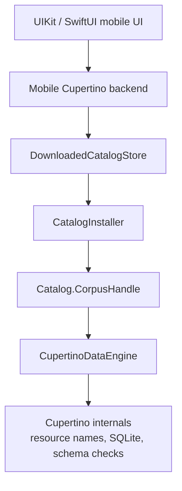

# Design: Mobile Catalog Delivery

| Field | Value |
|---|---|
| **Status** | accepted |
| **Created** | 2026-06-08 |
| **Tracking issues** | #1270, #1262 |

---

## Decision

Mobile apps do not bundle the Cupertino corpus. They install a free downloadable catalog after app install, verify it, place it in app support storage, and hand Cupertino an opaque `Catalog.CorpusHandle`.

The product may present this like a free content download, but the implementation should not use StoreKit unless a future entitlement requirement appears. No UI, desktop adapter, or mobile app layer should mention DB files, SQLite, or corpus filenames.

## Storage

Use the private app container by default:

```text
<App Container>/Library/Application Support/Catalogs/
    current.json
    releases/
        v1.1.0/
            manifest.json
            corpus/
    staging/
```

If multiple app targets share one catalog through an App Group, namespace it:

```text
<App Group Container>/Library/Application Support/Cupertino/Catalogs/
```

Do not use `Documents`. The catalog is re-downloadable support data, not a user-created document. Mark catalog storage as excluded from backup.

## Boundary



The UI observes catalog states such as `notInstalled`, `downloading`, `verifying`, `installing`, `ready`, `updateAvailable`, `failed`, and `removing`. Only Cupertino internals know the installed catalog is backed by database resources.

## Relationship To `cupertino setup`

`cupertino setup` remains the CLI installation path for desktop/server users. Mobile should reuse the same release manifest, archive, checksum, and extraction logic as a library API instead of shelling out to the CLI or exposing setup terminology in the app.

The shared implementation should keep the command behavior unchanged:

```text
cupertino setup
    -> catalog distribution library
        -> download
        -> verify
        -> extract

mobile app
    -> DownloadedCatalogStore
        -> catalog distribution library
        -> opaque CorpusHandle
```
